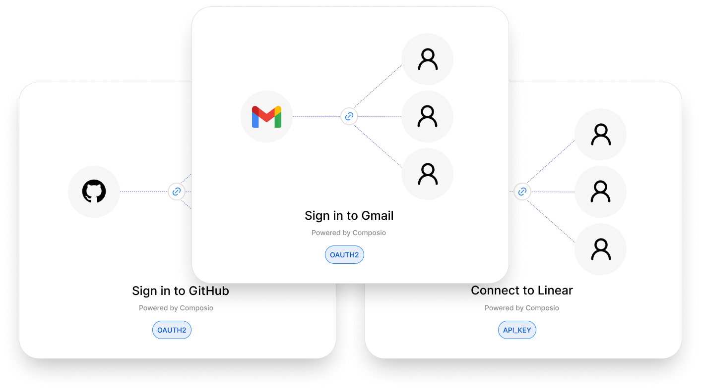

The first step in authenticating your Users is to create an **Auth Config**. Every toolkit has its own _authentication method_ such as **OAuth**, **API key**, **Basic Auth**, or custom schemes.

An **Auth Config** is a _blueprint_ that defines how authentication works for a toolkit across all your users. It defines:

1. **Authentication method** - _OAuth2_, _Bearer token_, _API key_, or _Basic Auth_
2. **Scopes** - _what actions your tools can perform_
3. **Credentials** - _whether you'll use your own app credentials or Composio's managed auth_

<Frame>
  
</Frame>

## Creating an auth config

### Using the Dashboard

<Steps>
  <Step title="**Selecting a toolkit**">
    Navigate to <a target="_blank"href="https://platform.composio.dev?next_page=%2Fauth-configs"target="_blank">Auth Configs</a> tab in your dashboard and click "**Create Auth Config**". Find and select the toolkit you want to integrate (e.g., **Gmail**, **Slack**, **GitHub**).
  </Step>
  <Step title="**Selecting the Authentication method**">
    Each toolkit supports different authentication methods such as **OAuth**, **API Key**, **Bearer
    Token**. Select from the available options for your toolkit.
  </Step>
  <Step title="**Configure scopes**">
    Depending on your authentication method, you may need to configure scopes: 
    - **OAuth2**: Configure scopes for what data and actions your integration can access. 
    - **API Key/Bearer Token**: Permissions are typically fixed based on the key's access level.
  </Step>
  <Step title="**Authentication Management**">
    **For OAuth toolkits:** 
      - **Development/Testing**: Use Composio's managed authentication (no setup required) 
      - **Production**: Generate your own OAuth credentials from the toolkit's developer portal 
    
    **For custom authentication schemes:** 
    
    You must provide your own credentials regardless of environment.
    
    <Tip>
    Want to remove Composio branding from OAuth screens? See [Custom Auth Configs](/docs/custom-auth-configs#white-labeling-the-oauth-consent-screen) for white-labeling options.
    </Tip>
  </Step>
  <Step title="**You are all set!**">
    Click "**Create Auth Configuration**" button and you have completed your first step! Now you can
    move ahead to authenticating your users by [Connecting an Account](#connecting-an-account).
  </Step>
</Steps>

<Note title="Auth configs are reusable">
  Auth configs contain your developer credentials and app-level settings (*scopes*, *authentication
  method*, etc.). Once created, you can reuse the same auth config for all your users.
</Note>

### When to create multiple auth configs?

You should create multiple auth configs for the same toolkit when you need:

- **Different authentication methods** - One OAuth config and one API key config
- **Different scopes** - Separate configs for read-only vs full access
- **Different OAuth apps** - Using separate client credentials for different environments
- **Different permission levels** - Limiting actions for specific use cases

<CardGroup cols={2}>
<Card title="Programmatic creation" href="/docs/programmatic-auth-configs" icon="fa-solid fa-code">
  For managing auth configs across multiple projects, you can create them programmatically via the
  API
</Card>
<Card title="Production white-labeling" href="/docs/custom-auth-configs#white-labeling-the-oauth-consent-screen" icon="fa-solid fa-palette">
  Remove Composio branding from OAuth screens for a fully white-labeled authentication experience
</Card>
</CardGroup>

## Connecting an account

With an auth config created, you're ready to authenticate your users!

You can either use [**Connect Link**](#hosted-authentication-connect-link) for a hosted authentication flow, or use [**Direct SDK Integration**](#direct-sdk-integration).

<Note>
User authentication requires a User ID - a unique identifier that groups connected accounts together. Learn more about [User Management](/docs/user-management) to understand how to structure User IDs for your application.
</Note> 

**Choose the section below that matches your toolkit's authentication method:**

### Hosted Authentication (Connect Link)

Redirect users to a Composio-hosted URL that handles the entire authentication process—OAuth flows, API key collection, or custom fields like subdomain. You can specify a callback URL to control where users return after authentication.

<Frame caption="Connect Link authentication screen">
  
</Frame>

<CodeGroup>
<SnippetCode 
  src="fern/snippets/authentication/python/connect-link.py" 
  title="Python"
  startLine={1} 
  endLine={22}
  highlightStart={11}
  highlightEnd={15}
/>

<SnippetCode 
  src="fern/snippets/authentication/typescript/connect-link.ts" 
  title="TypeScript"
  startLine={1} 
  endLine={19}
  highlightStart={11}
  highlightEnd={13}
/>
</CodeGroup>

#### Customizing Connect Link

By default, users will see a Composio-branded authentication experience when connecting their accounts. To customize this interface with your application's branding:

1. Navigate to your Project Settings and select [Auth Screen](https://platform.composio.dev?next_page=/settings/auth-screen)
2. Configure your **Logo** and **App Title**

These settings will apply to all authentication flows using Connect Link, providing a white-labeled experience that maintains your brand identity throughout the authentication process.

<Note>
For complete white-labeling including OAuth consent screens (removing Composio's domain), see [Custom Auth Configs - White-labeling](/docs/custom-auth-configs#white-labeling-the-oauth-consent-screen).
</Note>


### Direct SDK Integration

**Choose the section below that matches your toolkit's authentication method:**

#### OAuth Connections

For OAuth flows, you'll redirect users to complete authorization. You can specify a callback URL to control
where users return after authentication:

<CodeGroup>
```python Python {11-16}
from composio import Composio

composio = Composio(api_key="YOUR_COMPOSIO_API_KEY")

# Use the "AUTH CONFIG ID" from your dashboard
auth_config_id = "your_auth_config_id"

# Use a unique identifier for each user in your application
user_id = "user-1349-129-12"

connection_request = composio.connected_accounts.initiate(
  user_id=user_id,
  auth_config_id=auth_config_id,
  config={"auth_scheme": "OAUTH2"},
  callback_url="https://www.yourapp.com/callback"
)
print(f"Redirect URL: {connection_request.redirect_url}")

connected_account = connection_request.wait_for_connection()

# Alternative: if you only have the connection request ID
# connected_account = composio.connected_accounts.wait_for_connection(
#  connection_request.id)
# Recommended when the connection_request object is no longer available

print(f"Connection established: {connected_account.id}")

````

```typescript {10-16}
import { Composio } from '@composio/core';

const composio = new Composio({apiKey: "YOUR_COMPOSIO_API_KEY"});

// Use the "AUTH CONFIG ID" from your dashboard
const authConfigId = 'your_auth_config_id';
// Use a unique identifier for each user in your application
const userId = 'user_4567';

const connRequest = await composio.connectedAccounts.initiate(
  userId,
  authConfigId,
  {
    callbackUrl: 'https://www.yourapp.com/callback',
  }
);
console.log(`Redirect URL: ${connRequest.redirectUrl}`);

const connectedAccount = await connRequest.waitForConnection();

// Alternative: if you only have the connection request ID
// const connectedAccount = await composio.connectedAccounts
//   .waitForConnection(connRequest.id);
// Recommended when the connRequest object is no longer available

console.log(`Connection established: ${connectedAccount.id}`);
````

</CodeGroup>

#### Services with Additional Parameters

Some services like Zendesk require additional parameters such as `subdomain`:

<CodeGroup>
```python
# For Zendesk - include subdomain
connection_request = composio.connected_accounts.initiate(
  user_id=user_id,
  auth_config_id=auth_config_id,
  config=auth_scheme.oauth2(subdomain="mycompany")  # For mycompany.zendesk.com
)
```

```typescript
import { AuthScheme } from '@composio/core';
// For Zendesk - include subdomain
const connRequest = await composio.connectedAccounts.initiate(userId, authConfigId, {
  config: AuthScheme.OAuth2({
    subdomain: 'mycompany',
  }),
});
```

</CodeGroup>

#### API Key Connections

For API key authentication, you can either _collect API keys from each user_ or _use your own API key_ for all users. Popular Toolkits that use API Keys include Stripe, Perplexity etc.

Here is how to initiate the flow:

<CodeGroup>
```python {16-22}
from composio import Composio

composio = Composio(api_key="your_api_key")

# Use the "AUTH CONFIG ID" from your dashboard
auth_config_id = "your_auth_config_id"

# Use a unique identifier for each user in your application
user_id = "user_12323"

# API key provided by the user (collected from your app's UI)
# or use your own key
user_api_key = "user_api_key_here"

connection_request = composio.connected_accounts.initiate(
  user_id=user_id,
  auth_config_id=auth_config_id,
  config={
    "auth_scheme": "API_KEY", "val": {"api_key": user_api_key}
  }
)

print(f"Connection established: {connection_request.id}")

````

```typescript {12-16}
import { Composio, AuthScheme } from '@composio/core';

const composio = new Composio({ apiKey: 'your_api_key' });

// Use the "AUTH CONFIG ID" from your dashboard
const authConfigId = 'your_auth_config_id';
// Use a unique identifier for each user in your application
const userId = 'user12345678';
// API key provided by the user (collected from your app's UI)
const userApiKey = 'user_api_key_here';

const connectionRequest = await composio.connectedAccounts.initiate(userId, authConfigId, {
  config: AuthScheme.APIKey({
    api_key: userApiKey,
  }),
});

console.log(`Connection established: ${connectionRequest.id}`);
````

</CodeGroup>

## Fetching the required `config` parameters for an Auth Config

When working with any toolkits, you can **inspect an auth config** to understand its _authentication requirements_ and _expected parameters_.

Here is how you would fetch the authentication method and input fields:

<CodeGroup>
```python {9}
from composio import Composio

composio = Composio(api_key="your_api_key")

# Use the "AUTH CONFIG ID" from your dashboard
auth_config_id = "your_auth_config_id"

# Fetch the auth configuration details
auth_config = composio.auth_configs.get(auth_config_id)

# Check what authentication method this config uses
print(f"Authentication method: {auth_config.auth_scheme}")

# See what input fields are required
print(f"Required fields: {auth_config.expected_input_fields}")

````

```typescript {9}
import { Composio } from '@composio/core';

const composio = new Composio({ apiKey: 'your_api_key' });

// Use the "AUTH CONFIG ID" from your dashboard
const authConfigId = 'your_auth_config_id';

// Fetch the auth configuration details
const authConfig = await composio.authConfigs.get(authConfigId);

console.log(`Authentication method: ${authConfig.authScheme}`);
console.log(`Required fields:`, authConfig.expectedInputFields);
````

</CodeGroup>

## Other Authentication Methods

Composio also supports a wide range of other auth schemas:

**Bearer Token** - Similar to API keys, provide the user's bearer token directly when creating the connection.

**Basic Auth** - Provide username and password credentials for services that use HTTP Basic Authentication.

**Custom Schemes** - Some toolkits use their own custom authentication methods. Follow the toolkit-specific requirements for such cases.

<Note title="Fetching auth config">
  For any of these methods, [fetch the config
  parameter](#fetching-the-required-config-parameters-for-an-auth-config) to determine the exact
  fields required. Every toolkit has its own requirements, and understanding these is essential for
  successfully creating connections.
</Note>

Learn how to [Manage connected accounts](/docs/connected-accounts) after users authenticate.

## Connection Statuses

After creating a connection, it will have one of the following statuses that indicates its current state:

| Status | Description |
|--------|-------------|
| **ACTIVE** | Connection is established and working. You can execute tools with this connection. |
| **INACTIVE** | Connection is temporarily disabled. Re-enable it to use the connection again. |
| **PENDING** | Connection is being processed. Wait for it to become active. |
| **INITIATED** | Connection request has started but not yet completed. User may still need to complete authentication. |
| **EXPIRED** | Connection credentials have expired. Composio automatically attempts to refresh credentials before marking as expired. Re-authenticate to restore access. |
| **FAILED** | Connection attempt failed. Check error details and try creating a new connection. |

<Note>
When credentials expire for OAuth connections, Composio automatically attempts to refresh them using the refresh token. The connection is only marked as **EXPIRED** after multiple refresh attempts have failed. 
</Note>

### Waiting for Connection Establishment

The `waitForConnection` method allows you to poll for a connection to become active after initiating authentication. This is useful when you need to ensure a connection is ready before proceeding.

<CodeGroup>
<SnippetCode 
  src="fern/snippets/authentication/python/connect-link.py" 
  title="Python"
  startLine={20} 
  endLine={29}
/>

<SnippetCode 
  src="fern/snippets/authentication/typescript/connect-link.ts" 
  title="TypeScript"
  startLine={17} 
  endLine={26}
/>
</CodeGroup>

The method continuously polls the Composio API until the connection:
- Becomes **ACTIVE** (returns the connected account)
- Enters a terminal state like **FAILED** or **EXPIRED** (throws an error)
- Exceeds the specified timeout (throws a timeout error)

### Checking Connection Status

You can check the status of a connected account programmatically:

<CodeGroup>
<SnippetCode
  src="fern/snippets/tool-calling/python/checking-connection-status.py"
  title="Python"
  startLine={5}
  endLine={16}
/>
<SnippetCode
  src="fern/snippets/tool-calling/typescript/checking-connection-status.ts"
  title="Typescript"
  startLine={5}
  endLine={17}
/>
</CodeGroup>

<Note>
Only connections with **ACTIVE** status can be used to execute tools. If a connection is in any other state, you'll need to take appropriate action (re-authenticate, wait for processing, etc.) before using it.
</Note>

## Next Step

With authentication set up, you can now fetch and execute tools. See [Executing Tools](/docs/executing-tools) to get started.
