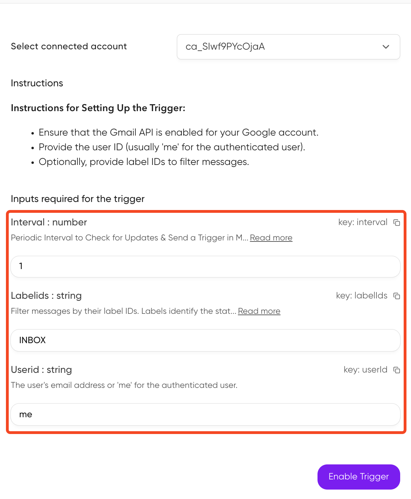

When **events** occur in connected apps (like new Slack messages or GitHub commits), triggers automatically send the event data to your application.

Each event is delivered as a **structured payload** to your webhook endpoint (via webhooks or WebSockets), enabling your applications or AI agents to respond proactively.

<Frame caption="Triggers through Composio" background="subtle">
  
</Frame>

<Tip title="Prerequisites">
  Before proceeding, ensure you've created an [auth
  config](/docs/authenticating-tools#creating-an-auth-config) and [established a
  connection](/docs/authenticating-tools#oauth-connections) to an app (e.g., Slack, GitHub). 
  Triggers are scoped to specific users - learn about [User Management](/docs/user-management) for guidance on structuring User IDs.
</Tip>

## Creating a trigger

You can create triggers using either the Composio dashboard or programmatically via the SDK.

### Using dashboard
To create triggers through the **dashboard**:

- Navigate to the <a href="https://platform.composio.dev?next_page=%2Fauth-configs" target="_blank">Auth Configs</a> page
- Select the auth config
- Click "Add Trigger" and navigate to "Active Triggers" tab to fetch the trigger ID.
  <video
    src="../../../assets/videos/enabling-triggers.mp4"
    width="854"
    height="480"
    autoplay
    loop
    playsinline
    controls
  ></video>

Some triggers require additional configuration. The dashboard will prompt you for any required fields during setup.

<Frame caption="Example: Gmail trigger configuration" background="subtle">
  
</Frame>

### Using SDK
Create triggers programmatically by providing the trigger type and any required configuration. The trigger instance will be created using the toolkit version configured during Composio initialization (defaults to `'latest'`).

<CodeGroup>
<SnippetCode
  src="fern/snippets/triggers/python/triggers.py"
  title="Python"
  startLine={1}
  endLine={18}
  highlightStart={12}
  highlightEnd={16}
/>

<SnippetCode
  src="fern/snippets/triggers/typescript/triggers.ts"
  startLine={1}
  endLine={22}
  highlightStart={12}
  highlightEnd={21}
  title="TypeScript"
/>
</CodeGroup>

<Note>
To use a specific toolkit version when creating triggers, configure `toolkitVersions` during initialization. See [Toolkit Versioning](/docs/toolkit-versioning) for more details.
</Note>


## Subscribing to triggers

### Webhooks

The recommended way to subscribe to triggers is through webhooks. Configure your webhook URL in the [Event & Trigger settings](https://platform.composio.dev?next_page=/settings/webhook).

Use a publicly accessible URL where Composio can send event payloads. This endpoint should be able to process incoming POST requests containing the trigger data.

<Tip>
  **Local development:** Use [ngrok](https://ngrok.com) or [webhook.site](https://webhook.site) to
  expose your local server to the internet for testing.
</Tip>

Webhook payloads contain:
- `type`: The trigger type identifier
- `data`: The actual event data  
- `timestamp`: When the event occurred
- `log_id`: Unique identifier for this event

Below are examples of webhook handlers for FastAPI and Next.js applications:

<CodeGroup>
<SnippetCode
  src="fern/snippets/triggers/python/trigger-webhook.py"
  title="Python (FastAPI)"
  startLine={34}
  endLine={47}
/>

<SnippetCode
  src="fern/snippets/triggers/typescript/trigger-webhook.ts"
  title="TypeScript (Next.js)"
  startLine={39}
  endLine={57}
/>
</CodeGroup>

### Verifying webhook signatures

Composio signs all webhook requests so you can verify they're authentic. Each webhook includes these headers:

- `webhook-signature`: HMAC signature in format `v1,<base64_signature>`  
- `webhook-id`: Unique message identifier
- `webhook-timestamp`: Unix timestamp when the webhook was sent

To enable verification:

1. Obtain your webhook secret from the [Composio dashboard](https://platform.composio.dev?next_page=/settings/webhook) under Project Settings → Webhook.
2. Set it as the `COMPOSIO_WEBHOOK_SECRET` environment variable
3. Use the verification function in your webhook handler:

<CodeGroup>
<SnippetCode
  src="fern/snippets/triggers/python/trigger-webhook.py"
  title="Python"
  startLine={10}
  endLine={32}
/>

<SnippetCode
  src="fern/snippets/triggers/typescript/trigger-webhook.ts"
  title="TypeScript"
  startLine={12}
  endLine={37}
/>
</CodeGroup>

The signature is calculated as:
```
signing_string = "{webhook-id}.{webhook-timestamp}.{raw_body}"
signature = HMAC-SHA256(signing_string, secret)
```

### Prototyping with trigger subscriptions

During development, you can subscribe to triggers directly through the SDK without setting up webhooks.

You can subscribe to **multiple** trigger events by **configuring the filters**. When you specify multiple filters, ALL of them must match for the trigger to be subscribed to.

<CodeGroup>
  <SnippetCode src="fern/snippets/triggers/python/trigger-subscription.py" title="Python" />
  <SnippetCode src="fern/snippets/triggers/typescript/trigger-subscription.ts" title="Typescript" />
</CodeGroup>

## Trigger payload types

To see what data you'll receive in your webhook handler, inspect the trigger's payload:

<CodeGroup>
```python Python maxLines=60 wordWrap
# Get trigger type to inspect payload structure
trigger = composio.triggers.get_type(slug="GITHUB_COMMIT_EVENT")
print(trigger.payload)
```

```typescript TypeScript maxLines=60 wordWrap
// Get trigger type to inspect payload structure
const triggerType = await composio.triggers.getType('GITHUB_COMMIT_EVENT');

console.log(triggerType.payload);
```

</CodeGroup>

### Type-safe trigger handling (TypeScript)

For better type safety and developer experience in TypeScript, you can define specific payload types and use the `TriggerEvent<T>` interface:

<CodeGroup>
<SnippetCode
  src="fern/snippets/triggers/typescript/trigger-types.ts"
  title="Type-safe trigger subscription"
  startLine={3}
  endLine={26}
/>

<SnippetCode
  src="fern/snippets/triggers/typescript/trigger-webhook.ts"
  title="Type-safe webhook handling"
  startLine={3}
  endLine={18}
/>
</CodeGroup>

This approach provides:

- **IntelliSense support** for trigger payload fields
- **Compile-time error checking** for typos and invalid field access
- **Better documentation** through TypeScript types
- **Improved maintainability** of trigger handling code

## Managing triggers

### Enable/disable triggers

You can pause triggers temporarily without deleting them.

<Tabs>
<Tab title="Dashboard">
1. Go to the [Auth Config](https://platform.composio.dev?next_page=/auth-configs) page
2. Select your auth config
3. Navigate to "Active Triggers"
4. Disable/Enable the trigger

<Frame caption="Enable/disable triggers" background="subtle">
  
</Frame>
</Tab>

<Tab title="SDK">
<CodeGroup>
```python Python
# Disable a trigger
composio.triggers.disable(trigger_id="ti_abcd123")

# Re-enable when needed

composio.triggers.enable(trigger_id="ti_abcd123")

````
``` typescript TypeScript
// Disable a trigger
await composio.triggers.disable('ti_abcd123');

// Re-enable when needed
await composio.triggers.enable('ti_abcd123');

````

</CodeGroup>
</Tab>
</Tabs>

## Troubleshooting

View detailed trigger logs and debug issues on the [Composio dashboard](https://platform.composio.dev?next_page=/logs/triggers).