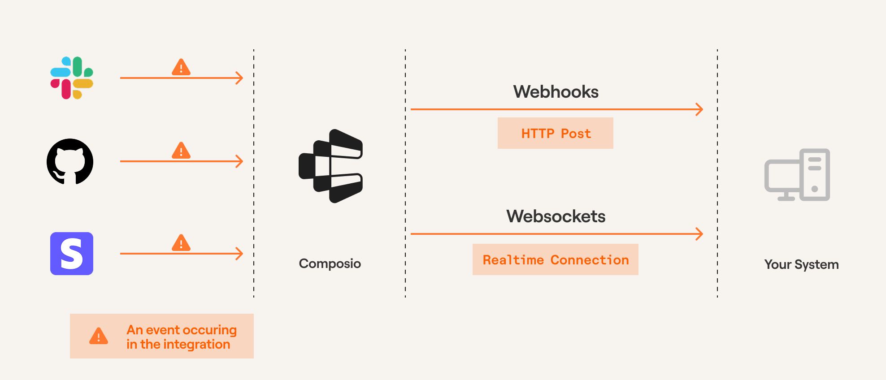

Triggers act as a notification system for your AI applications, enabling your agents to respond dynamically to external events occurring within your apps.


When these events take place, triggers capture relevant information and deliver structured payloads directly to your system, letting you build agents that respond proactively.

<Frame caption="Triggers through Composio" background="subtle">
  
</Frame>

<Tip title="Prerequisites">
  Before proceeding, ensure you've created an [auth config](/docs/authenticating-tools#creating-an-auth-config) and [established a connection](/docs/authenticating-tools#connecting-to-an-oauth-toolkit) to an app (e.g., Slack, GitHub).
</Tip>

## Creating a trigger

Head to any app that supports triggers, such as [Slack](https://app.composio.dev/app/slack) in the dashboard and enable the trigger of choice.
<Tabs>
<Tab title="Dashboard">
<video
  src="../../../assets/videos/enabling-triggers.mp4"
  width="854"
  height="480"
  autoplay
  loop
  playsinline
  controls
></video>

<Frame caption="Triggers page" background="subtle">
  
</Frame>

In some cases, triggers require certain configuration to set the correct events. You can inspect and add these properties while enabling the triggers.

The dashboard will show you the trigger configuration to fill in.

<Frame caption="Trigger configuration" background="subtle">
  
</Frame>


</Tab>
<Tab title="SDK">
You can also create triggers programmatically using the SDK. To get started, first view the required configuration for creating a trigger:

<CodeGroup>
<SnippetCode
  src="fern/snippets/triggers/python/triggers.py"
  title="Python"
  startLine={1}
  endLine={12}
  highlightStart={10}
  highlightEnd={10}
/>

<SnippetCode
  src="fern/snippets/triggers/typescript/triggers.ts"
  startLine={1}
  endLine={13}
  highlightStart={8}
  highlightEnd={11}
  title="TypeScript"
/>
</CodeGroup>


Most triggers require certain configuration to send the correct events. For example, `GITHUB_COMMIT_EVENT` requires you to specify the repository and owner.

**Fetch required trigger configuration**

<CodeGroup>
<SnippetCode
  src="fern/snippets/triggers/python/triggers.py"
  startLine={13}
  endLine={32}
  title="Python"
/>

<SnippetCode
  src="fern/snippets/triggers/typescript/triggers.ts"
  startLine={5}
  endLine={29}
  title="TypeScript"
/>
</CodeGroup>
</Tab>
</Tabs>

The [triggers page](https://app.composio.dev/active_triggers?page=1) will show you all the triggers that are enabled for your account.


## Subscribing to triggers
The typical and recommended way to subscribe to triggers is through webhooks.


To receive trigger events via webhooks, you need to configure a publicly accessible URL where Composio can send the event payloads. This URL should point to an endpoint in your application that can process incoming webhook requests.

<Tip title="Use ngrok/webhook.site for local dev!">
During development, you can use ngrok/webhook.site or other services to expose your local server to the internet.
</Tip>

<Frame caption="Webhook setup" background="subtle">
  
</Frame>

Below are some examples of how to listen in on trigger events for a FastAPI/Next.js application.

<CodeGroup>
<SnippetCode
  src="fern/snippets/triggers/python/trigger-webhook.py"
  title="app/route.py"
/>

<SnippetCode
  src="fern/snippets/triggers/typescript/trigger-webhook.ts"
  title="app/api/webhook/route.ts"
/>
</CodeGroup>

## Trigger payload types
When subscribing to triggers, it is helpful to know the payload type recieved from the trigger. You can inspect the payload type by fetching the trigger type.

<CodeGroup>
```python Python maxLines=60 wordWrap
# Get a trigger by id
trigger = composio.triggers.get_type(slug="GITHUB_COMMIT_EVENT")
print(trigger.payload)
```

```typescript TypeScript maxLines=60 wordWrap
const triggerType = await composio.triggers.getType("GITHUB_COMMIT_EVENT");

console.log(triggerType.payload);
```

</CodeGroup>


## Prototyping triggers during development
During development, you may not have a proper webhook setup -- so you can subscribe to triggers directly through the SDK.

You subscribe to multiple trigger events by configuring the filters. When you specify multiple filters, ALL of them must match for the trigger to be subscribed to.

This method uses WebSocket to subscribe to the trigger.

<CodeGroup>
```python Python maxLines=60 wordWrap
user_id = "user@email.com"

# Subscribe to a trigger
subscription = composio.triggers.subscribe()

# Define a handler
@subscription.handle(toolkit="GITHUB", user_id=user_id)
def handle_github_event(data):
    print(data)
```
```typescript TypeScript maxLines=60 wordWrap
await composio.triggers.subscribe(
  triggerData => {
    console.log('Received trigger:', triggerData);
  },
  {
    triggerId: 'ti_So9EQf8XnAcy',
    // userId: 'user@acme.com',
    // toolkits: ['github', 'slack'],
    // triggerSlug: ["GITHUB_STAR_ADDED_EVENT"]
    // authConfigId: "ac_1234567890"
  }
)
```
</CodeGroup>

## Enabling/Disabling triggers

In cases where the trigger isn't required for the system, it can be disabled.

<CodeGroup>
  ```python Python maxLines=60 wordWrap
  # Disable a trigger instance 
  disabled_instance = composio.triggers.disable(trigger_id="ti_abcd123")
  print(disabled_instance) 
  ```
  ```typescript TypeScript maxLines=60 wordWrap
  await composio.triggers.disable("ti_abcd123");
  ```
</CodeGroup>

If needed, the trigger can be enabled again.

<CodeGroup>
  ```python Python maxLines=60 wordWrap
  # Enable a trigger instance
  enabled_instance = composio.triggers.enable(trigger_id="ti_abcd123")
  print(enabled_instance)
  ```
  ```typescript TypeScript maxLines=60 wordWrap
  await composio.triggers.enable("ti_abcd123");
  ```
</CodeGroup>

## Troubleshooting
If you encounter issues with triggers or webhook listeners, you can use the Composio dashboard to inspect detailed trigger logs. The dashboard allows you to review event payloads, identify errors, and manually resend events for testing purposes.

Access the trigger logs [here](https://app.composio.dev/trigger_logs).

<Frame caption="Trigger logs" background="subtle">
  
</Frame>