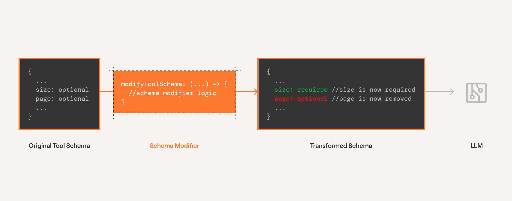

Schema modifiers are part of Composio SDK's powerful middleware capabilities that allow you to customize and extend the behavior of tools.

## Schema Modifiers
Schema modifiers transform a tool's schema before the tool is seen by an agent.

<Frame>
    
</Frame>
**Useful for:**
- Adding arguments to the tool. For example, adding a `thought` argument to the tool to prompt the agent to explain the reasoning.
- Hiding arguments from the tool. In cases where the argument is irrelevant to the tool.
- Adding extra arguments to the tool schema for custom use cases or execution.
- Adding default values to tool arguments.

<Note>
Below we modify the schema of the `HACKERNEWS_GET_LATEST_POSTS` to make the `size` argument required and remove the `page` argument.
</Note>

<CodeGroup>
```typescript TypeScript maxLines=60 wordWrap
const userId = "your@email.com";

const tools = await composio.tools.get(
  userId,
  {
    tools: ["HACKERNEWS_GET_LATEST_POSTS", "HACKERNEWS_GET_USER"],
  },
  {
    modifyToolSchema: (toolSlug, _, toolSchema) => {
      if (toolSlug === "HACKERNEWS_GET_LATEST_POSTS") {
        const { inputParameters } = toolSchema;
        if (inputParameters?.properties) {
          delete inputParameters.properties["page"];
        }
        inputParameters.required = ["size"];
      }
      return toolSchema;
    },
  }
);

console.log(JSON.stringify(tools, null, 2));
```
```python Python maxLines=60  wordWrap

```
</CodeGroup>

In using the above modified tool schema, the `page` argument is removed and the `size` argument is required.

You can test this out by viewing the tool call response in the LLM too! 

<Accordion title="Schema modified tool call">
<CodeGroup>

```typescript TypeScript maxLines=60 wordWrap
import { Composio } from "@composio/core";
import { OpenAI } from "openai";

const composio = new Composio({
  apiKey: process.env.COMPOSIO_API_KEY,
});
const openai = new OpenAI();

const userId = "your@email.com";

const tools = await composio.tools.get(
  userId,
  {
    tools: ["HACKERNEWS_GET_LATEST_POSTS", "HACKERNEWS_GET_USER"],
  },
  {
    modifyToolSchema: (toolSlug, _, toolSchema) => {
      if (toolSlug === "HACKERNEWS_GET_LATEST_POSTS") {
        const { inputParameters } = toolSchema;
        if (inputParameters?.properties) {
          delete inputParameters.properties["page"];
        }
        inputParameters.required = ["size"];
      }
      return toolSchema;
    },
  }
);

console.log(JSON.stringify(tools, null, 2));

const response = await openai.chat.completions.create({
  model: "gpt-4o-mini",
  messages: [
    {
      role: "system",
      content: "You are a helpful assistant that can help with tasks.",
    },
    { role: "user", content: "Get the latest posts from Hacker News" },
  ],
  tools: tools,
  tool_choice: "auto",
});

console.log(response.choices[0].message.tool_calls);
```
```python Python maxLines=60 wordWrap

```
</CodeGroup>
</Accordion> 