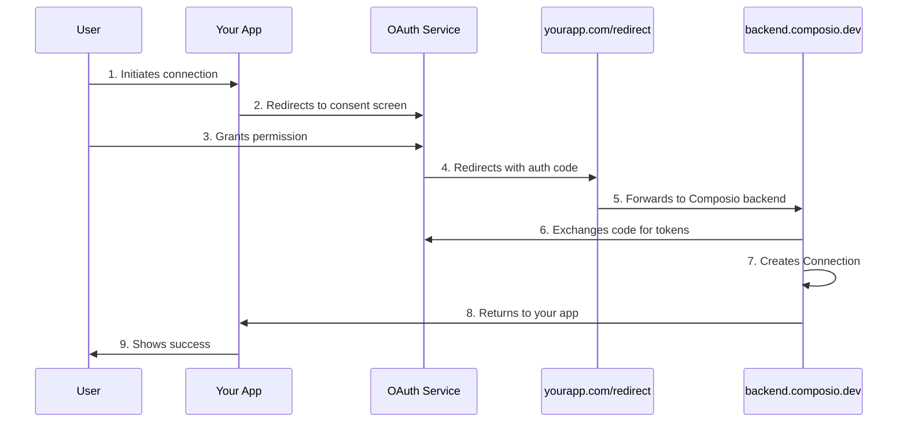

## Using custom auth app (aka white-labelling)
When going to production, it's recommended to use your own developer credentials.


<Steps>
<Step title="Set up a 301 redirect">
The endpoint `https://backend.composio.dev/api/v1/auth-apps/add` is what captures the user's credentials to manage the auth. However, OAuth consent screens show the callback URL - and if it isn't the same as your application, that creates distrust.

It's recommended to specify the redirect URL to your own domain and create a redirect logic, either through your DNS or in your application to redirect that endpoint to `https://backend.composio.dev/api/v1/auth-apps/add`

<Accordion title="Setting up a redirect through DNS">
- [Cloudflare URL Forwarding Guide](https://developers.cloudflare.com/rules/url-forwarding/single-redirects/create-dashboard/)

- [GoDaddy Domain Forwarding Guide](https://www.godaddy.com/en-in/help/forward-my-godaddy-domain-12123)

- [Namecheap URL Redirect Setup Guide](https://www.namecheap.com/support/knowledgebase/article.aspx/385/2237/how-to-set-up-a-url-redirect-for-a-domain/)
</Accordion>

<Note>Whether using DNS or application-level redirects, ensure you're preserving the query string and all params and headers are forwarded correctly</Note>

This diagram shows the entire redirect sequence.


</Step>

<Step title="Create the integration">
Create your integration, specifying the redirect URL in the auth configuration.

<Tip>Make sure to set the `use_composio_oauth_app` / `useComposioAuth` flag to False!</Tip>

Refer to the [concepts](/auth/introduction#retrieve-connection-parameters) page for more information on how to retrieve the auth configuration for an integration.
<CodeGroup>
```python Python {8-12}
from composio_openai import App, ComposioToolSet

toolset = ComposioToolSet()
integration = toolset.create_integration(
    app=App.GOOGLECALENDAR,
    auth_mode="OAUTH2",
    use_composio_oauth_app=False,
    auth_config={
      "client_id": "12345678",
      "client_secret": "12345678",
      "redirect_uri": "https://yourapp.com/redirect"
    }
)

entity = toolset.get_entity("default")

connection_request = entity.initiate_connection(
    app_name=App.GOOGLECALENDAR, integration=integration
)
print(connection_request)
```

```typescript TypeScript {9-13}
import { OpenAIToolSet } from "composio-core";
const composioToolset = new OpenAIToolSet();

const integration = await composioToolset.integrations.create({
  appUniqueKey: "googlecalendar",
  name: "Google Calendar",
  authScheme: "OAUTH2",
  useComposioAuth: false,
  authConfig: {
    client_id: "12345678",
    client_secret: "12345678",
    redirect_uri: "https://yourapp.com/redirect",
  },
});
```
</CodeGroup>

</Step>

<Step title="Create the connection">
Now you can create the connection. Make sure to include the `redirectUri` parameter and set it to where the user should be redirected to after the auth process is finished.

<CodeGroup>
```python Python {10-11}
user_id = "00000000-0000-0000-0000-000000000000"
entity = toolset.get_entity(user_id)

thread_id = "12345678"
redirect_url = "https://yourapp.com/thread/{thread_id}" # Example redirect URL

conn_req = entity.initiate_connection(
    app_name=App.GOOGLECALENDAR,
    auth_mode="OAUTH2",
    use_composio_auth=False,
    redirect_url=redirect_url
)

print(conn_req.redirect_url)
```


```typescript TypeScript {9-10}
const user_id = "00000000-0000-0000-0000-000000000000";
const entity = await composioToolset.getEntity(user_id);

const thread_id = "12345678"; 
const redirect_url = `https://yourapp.com/thread/${thread_id}`; // Example redirect URL

const connectionRequest = await entity.initiateConnection({
  integrationId: integration.id,
  useComposioAuth: false,
  redirectUri: redirect_url,
});

console.log(connectionRequest.redirectUrl);
```
</CodeGroup>
</Step>
</Steps>

The connection request returns a redirect URL that you can emit to the user to start the auth process. They see the custom consent screen that you configured.
In this case, it's "usefulagents.com"

<Frame background="subtle" title="Custom Auth Consent Screen">
  
</Frame>