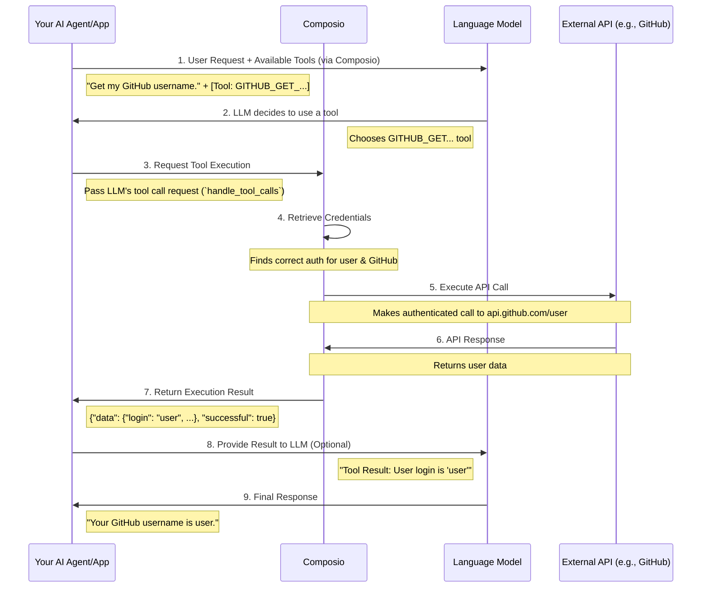

Tool calling as a concept was introduced due to LLMs lack of ability to interact with data and influence external systems. Earlier you might be able to ask an LLM to write you a nice email, but you would have to manually send it. With tool calling, you can now provide an LLM a valid tools for example, [`GMAIL_SEND_EMAIL`](/tools/gmail#gmail_send_email) to go and accomplish the task autonomously.

Composio extends this by providing a platform to connect your AI agents to external tools like Gmail, GitHub, Salesforce, etc. It's like a bridge between your AI and the tools it needs to get work done.

## Tool Calling with Composio
Here’s a typical flow when your agent uses a tool via Composio:



Essentially: Your app gets tool definitions from Composio, the LLM decides which to use, your app tells Composio to run it (`handle_tool_calls`), and Composio securely executes the real API call.

## Example: Using a Composio Tool with OpenAI

Let's see this in action. We'll ask an OpenAI model to fetch a GitHub username using a pre-built Composio tool.

*(Assumes you've completed the [Setup steps](/getting-started/quickstart#setup): installed SDKs, run `composio login`, and `composio add github`)*

**1. Initialize Clients & Toolset**
Get your LLM client and Composio toolset ready.

<CodeGroup>
```python Python
from composio_openai import ComposioToolSet, App, Action
from openai import OpenAI
# Assumes .env file with API keys is loaded

client = OpenAI()
toolset = ComposioToolSet() # Uses default entity_id
```
```typescript TypeScript
import { OpenAIToolSet, App, Action } from "composio-core";
import { OpenAI } from "openai";
// Assumes .env file with API keys is loaded

const client = new OpenAI();
const toolset = new OpenAIToolSet(); // Uses default entityId
```
</CodeGroup>

**2. Get the Composio Tool**
Fetch the specific tool definition from Composio, formatted for your LLM.

<CodeGroup>
```python Python
# Fetch the tool for getting the authenticated user's GitHub info
tools = toolset.get_tools(actions=[Action.GITHUB_GET_THE_AUTHENTICATED_USER])
print(f"Fetched {len(tools)} tool(s) for the LLM.")
```
```typescript TypeScript
// Fetch the tool for getting the authenticated user's GitHub info
const tools = await toolset.getTools({ actions: ["GITHUB_GET_THE_AUTHENTICATED_USER"] });
console.log(`Fetched ${tools.length} tool(s) for the LLM.`);
```
</CodeGroup>

**3. Send Request to LLM**
Provide the user's task and the Composio tools to the LLM.

<CodeGroup>
```python Python
task = "What is my GitHub username?"
messages = [{"role": "user", "content": task}]

print(f"Sending task to LLM: '{task}'")
response = client.chat.completions.create(
    model="gpt-4o-mini",
    messages=messages,
    tools=tools,
    tool_choice="auto" # Instruct LLM to choose if a tool is needed
)
```
```typescript TypeScript
const task = "What is my GitHub username?";
const messages = [{ role: "user" as const, content: task }];

console.log(`Sending task to LLM: '${task}'`);
const response = await client.chat.completions.create({
    model: "gpt-4o-mini",
    messages: messages,
    tools: tools,
    tool_choice: "auto" // Instruct LLM to choose if a tool is needed
});
```
</CodeGroup>

**4. Handle Tool Call via Composio**
If the LLM decided to use a tool, pass the response to `handle_tool_calls`. Composio takes care of the execution.

<CodeGroup>
```python Python
execution_result = None
response_message = response.choices[0].message

if response_message.tool_calls:
    print("LLM requested tool use. Executing via Composio...")
    # Composio handles auth, API call execution, and returns the result
    execution_result = toolset.handle_tool_calls(response)
    print("Execution Result from Composio:", execution_result)
else:
    print("LLM responded directly (no tool used):", response_message.content)

# Now 'execution_result' holds the data returned by the GitHub API call
# You could parse it or feed it back to the LLM for a final summary.
```
```typescript TypeScript
let executionResult: any = null;
const responseMessage = response.choices[0].message;

if (responseMessage.tool_calls) {
    console.log("LLM requested tool use. Executing via Composio...");
    // Composio handles auth, API call execution, and returns the result
    executionResult = await toolset.handleToolCall(response);
    console.log("Execution Result from Composio:", executionResult);
} else {
    console.log("LLM responded directly (no tool used):", responseMessage.content);
}

// Now 'executionResult' holds the data returned by the GitHub API call
// You could parse it or feed it back to the LLM for a final summary.
```
</CodeGroup>

This example showcases how Composio seamlessly integrates with the LLM's tool-calling mechanism, handling the complex parts of API interaction securely and reliably.
