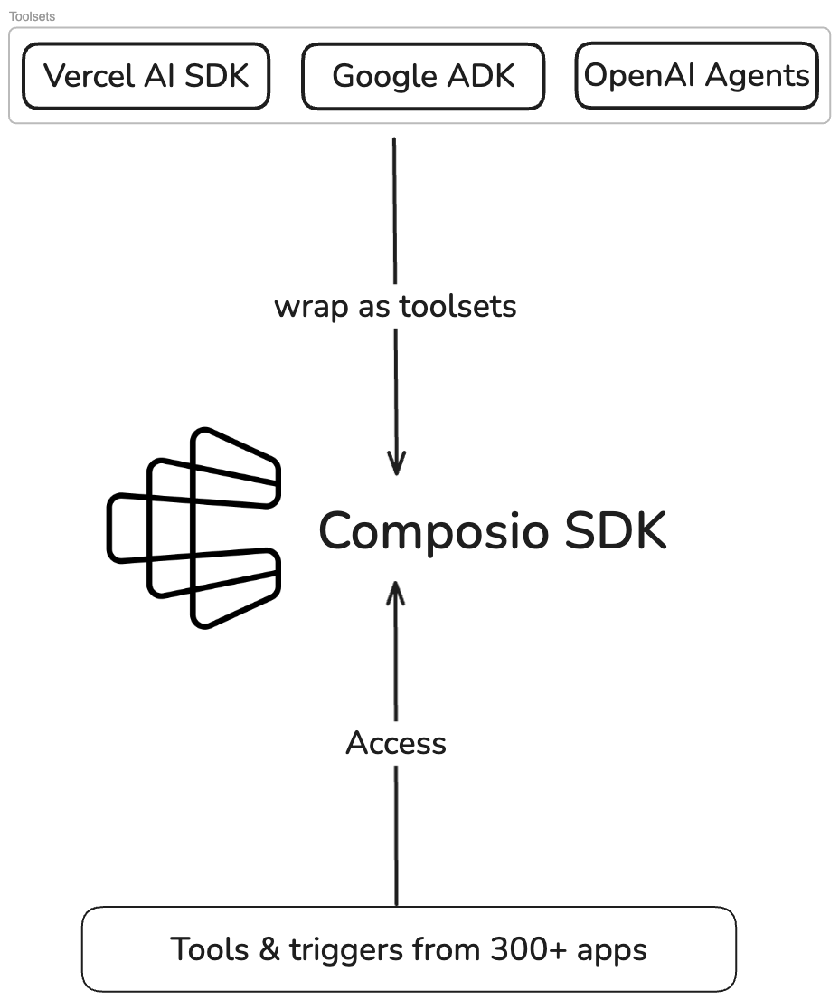

Companies such as OpenAI and Anthropic (providers) offer access to a range of large language models (LLMs) with differing strengths and capabilities through their own APIs and SDKs.

Coupled with provider specific SDKs, there also exist a range of LLM and Agentic frameworks that offer different ways to build and deploy AI agents.

Each provider and framework typically has its own unique method for interfacing with their models, complicating the process of switching providers and increasing the risk of vendor lock-in.

To solve these challenges, Composio offers a standardized approach to interacting with LLMs through a language model specification that abstracts differences between providers. This unified interface allows you to switch between providers with ease while using the same API for all providers.

<Frame>
  
</Frame>

## Supported Providers & Toolsets

- [OpenAI Provider](/toolsets/openai)
- [Anthropic Provider](/toolsets/anthropic)
- [LangGraph Provider](/toolsets/langgraph)
- [CrewAI Toolset](/toolsets/crewai)
- [Vercel AI SDK Toolset](/toolsets/vercel-ai-sdk)
- [Google ADK Toolset](/toolsets/google-adk)
- [OpenAI Agents Toolset](/toolsets/openai-agents)
- [Mastra Toolset](/toolsets/mastra)

<Tip title="Custom Toolsets" icon="puzzle">
Using a framework not supported? Create a [custom toolset](/toolsets/custom)!
</Tip>