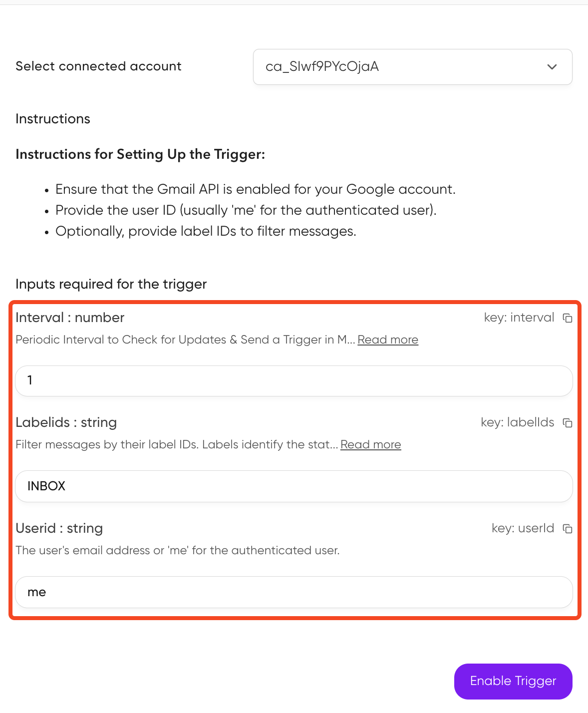

Triggers act as a notification system for your AI applications, enabling your agents to respond dynamically to external events occurring within your integrations.

When these events take place, triggers capture relevant information and deliver structured payloads directly to your system, facilitating timely and context-aware responses.


<Frame caption="Triggers through Composio" background="subtle">

</Frame>


<Tip title="Prerequisites">
Before proceeding, ensure you've created an auth config and established a connection to your external account (e.g., Slack, GitHub).
</Tip>

## Creating a trigger
Head to the any app that supports triggers, eg [Slack](https://app.composio.dev/app/slack) in the dashboard and enable the trigger of choice.
<video 
    src="../../../assets/videos/enabling-triggers.mp4"
    width="854"
    height="480"
    autoplay
    loop
    playsinline
    controls
>
</video>

The [triggers page](https://app.composio.dev/active_triggers?page=1) will show you all the triggers that are enabled for your account.

<Frame caption="Triggers page" background="subtle">

</Frame>

You create triggers through the SDK as well.

<CodeGroup>
```typescript TypeScript
const createResponse = await composio.triggers.create("GITHUB_STAR_ADDED_EVENT", {
  connectedAccountId: "ca_abc1234",
  triggerConfig: {
    owner: "composiohq",
    repo: "composio",
  },
});
```
```python Python

```
</CodeGroup>

You need to fetch the connection ID for the user to create a trigger.

<CodeGroup>
```typescript TypeScript
const userId = "user@acme.com";

const connections = await composio.connectedAccounts.list({userIds: [userId]});

console.log(connections.items[0].id);

const createResponse = await composio.triggers.create("GITHUB_STAR_ADDED_EVENT", {
  connectedAccountId: connections.items[0].id,
  triggerConfig: {
    owner: "composiohq",
    repo: "composio",
  },
});
```
```python Python

```
</CodeGroup>

## Subscribing to triggers
You can subscribe to triggers to receive payloads from the trigger.

You subscribe to multiple trigger events by configuring the filter.

- [ ] check and test the filters properly. ie, do they work individually or as union?

<CodeGroup>
```typescript TypeScript
await composio.triggers.subscribe(
  triggerData => {
    console.log('Received trigger:', triggerData);
  },
  {
    triggerId: 'ti_So9EQf8XnAcy',
    // userId: 'user@acme.com',
    // toolkits: ['github', 'slack'],
  }
)
```
```python Python

```
</CodeGroup>

### Trigger payload types
When subscribing to triggers, it is helpful to know the payload type recieved from the trigger. You can inspect the payload type by fetching the trigger type.

<CodeGroup>
```typescript TypeScript
const triggerType = await composio.triggers.getType("GITHUB_STAR_ADDED_EVENT");

console.log(triggerType.payload);
```
```python Python

```
</CodeGroup>

## Specifying trigger configuration
In some cases, triggers require certain configuration to set the correct events. You can inspect and add these properties while enabling the triggers.

The dashboard will show you the trigger configuration to fill in.

<Frame caption="Trigger configuration" background="subtle">

</Frame>

<CodeGroup>
```typescript TypeScript
const triggerType = await composio.triggers.getType("GITHUB_STAR_ADDED_EVENT");

console.log(triggerType.config.properties);

await composio.triggers.create("GITHUB_STAR_ADDED_EVENT", {
  connectedAccountId: "ca_1DirCHFzH7v4",
  triggerConfig: {
    owner: "composiohq",
    repo: "composio",
  },
});
```
```python Python

```
</CodeGroup>


<CodeGroup>
```typescript TypeScript
await composio.triggers.create("GITHUB_PULL_REQUEST_EVENT", {
  connectedAccountId: "ca_k_py8Qbd17_d",
  triggerConfig: {  // Properties expected for trigger config
    owner: "composiohq",
    repo: "composio",
  },
});
```
```python Python
```
</CodeGroup>


## Enabling/Disabling triggers
In cases where the trigger isn't required for the system, it can be disabled.

<CodeGroup>
```typescript TypeScript
await composio.triggers.disable("ti_So9EQf8XnAcy");
```
```python Python

```
</CodeGroup>

If needed, the trigger can be enabled again.

<CodeGroup>
```typescript TypeScript
await composio.triggers.enable("ti_So9EQf8XnAcy");
```
```python Python

```
</CodeGroup>

