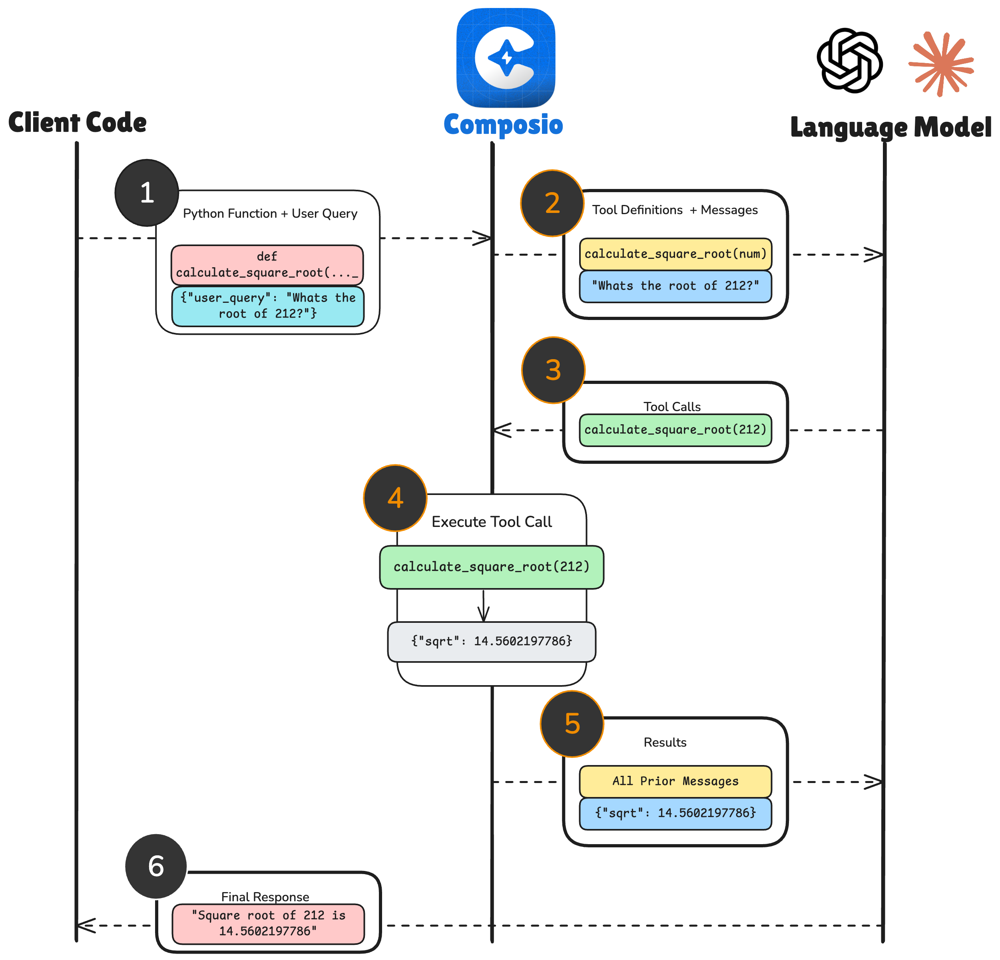

Tool calling enables AI models to perform tasks beyond simple conversations, allowing them to interact with external services and applications. Instead of just answering questions, your AI assistant can now browse the internet, schedule meetings, update CRM records, or even manage tasks in project management tools.

With Composio, your AI apps and agents gain access to over 250 integrations, including popular services like GitHub, Google Calendar, Salesforce, Slack, and many more. This means your AI agents can seamlessly handle real-world tasks, saving you time and effort.

## Overview

<Frame caption="Tool Calling with Composio" background="subtle">
  
</Frame>


Here's the preceding example in code:

<CodeGroup>
```python maxLines=100 wordWrap {9-20, 36} Python
from composio_openai import ComposioToolSet, action
from typing import Annotated
from openai import OpenAI
import math

client = OpenAI()
toolset = ComposioToolSet()

@action(toolname="calculate_square_root", requires=["math"])
def calculate_square_root(
    a: Annotated[int, "Number from which to take the square root"],
) -> float:
    """
    Calculate the square root of a number.
    :param a: Number from which to take the square root
    :return sqrt: Square root of the number
    """
    return math.sqrt(a)

tools = toolset.get_tools([calculate_square_root])

question = "What is the square root of 212?"

response = client.chat.completions.create(
    model="gpt-4o-mini",
    messages=[
        {
            "role": "user",
            "content": question,
        }
    ],
    tools=tools,
    tool_choice="auto",
)

result = toolset.handle_tool_calls(response=response)

print("Question: ", question)
print("Answer: ", result[0]["data"]["sum"])
```

```typescript maxLines=100 wordWrap {11-28, 42} TypeScript
import { ActionExecutionResDto, OpenAIToolSet, RawExecuteRequestParam } from "composio-core"
import { OpenAI } from "openai";
import { z } from "zod"
import dotenv from "dotenv";

dotenv.config();

const openai_client = new OpenAI();
const toolset = new OpenAIToolSet();

await toolset.createAction({
  actionName: "calculateSum",
  description: "Calculate the sum of two numbers",
  inputParams: z.object({
      a: z.number(),
      b: z.number()
  }),
  callback: async (inputParams: {}, authCredentials: Record<string, string> | undefined, executeRequest: (data: RawExecuteRequestParam) => Promise<ActionExecutionResDto>) => {
      const { a, b } = inputParams as { a: number, b: number };
      const sum = a + b;
      return {
        successful: true,
        data: {
          sum: sum
        }
      };
  }
});

const tools = await toolset.getTools({
  actions: ["calculateSum"]
});
const instruction = "What is 3932 + 2193?";

const response = await openai_client.chat.completions.create({
  model: "gpt-4o-mini",
  messages: [{ role: "user", content: instruction }],
  tools: tools,
  tool_choice: "auto",
});

const result = await toolset.handleToolCall(response);
console.log(result);
```

</CodeGroup>

<Steps>
<Step>
**Create tool**
- Convert a function into LLM-readable form using the `@action` wrapper (Python) or the callback function (JS)
</Step>

<Step>
**LLM calls the tool**
- The LLM reasons about the user's query and decides whethere to use a tool.
- If yes, the LLM generate a properly formatted tool use request with the input parameters specified.
</Step>
<Step>
**Handling of the tool call**
- Composio intercepts, interprets, and calls the actual method defined.
`handle_tool_calls` method interprets the tool call and calls the actual method defined.
</Step>
</Steps>

## Tool Calling with Composio

Composio supports three main ways to use tool calling:

<Card title="Hosted Tools" icon="cloud" href="#using-composios-hosted-tools">
  Pre-built tools that Composio hosts and maintains, giving you instant access
  to thousands of actions across hundreds of apps.
</Card>

<Card title="Local Tools" icon="computer" href="#using-composios-local-tools">
  Tools that run locally in your environment, like file operations or custom
  business logic.
</Card>

<Card title="Custom Tools" icon="tools" href="#using-custom-tools">
  Your own tools defined using Composio's tool definition format, which can be
  hosted anywhere.
</Card>

### Using Composio's Hosted Tools

Composio hosts a growing list of tools from various popular apps like _Gmail_,
_Notion_ to essential apps for AI Engineers like _Firecrawl_, _Browserbase_.

This lets you build AI apps and agents without having to manually write the API
calls and integrations in the tool format.

Here's an example of using [Firecrawl](https://www.firecrawl.dev/) with to
scrape a webpage.

<Tip>You will need to add a Firecrawl integration. Learn how to do it [here](https://app.composio.dev/app/firecrawl?addConnectorWizard=false)</Tip>
<CodeGroup>
```python Python {7}
from composio_openai import ComposioToolSet
from openai import OpenAI

client = OpenAI()
toolset = ComposioToolSet()

tools = toolset.get_tools(["FIRECRAWL_SCRAPE_EXTRACT_DATA_LLM"])
task = "Scrape https://example.com and extract the data"
response = client.chat.completions.create(
    model="gpt-4o-mini",
    messages=[{"role": "user", "content": task}],
    tools=tools,
    tool_choice="auto",
)

result = toolset.handle_tool_calls(response)
print(result)
```

```javascript JavaScript
import { OpenAIToolSet } from "composio-core"
import { OpenAI } from "openai";

const openai_client = new OpenAI();
const toolset = new OpenAIToolSet();

const tools = await toolset.getTools({
  actions: ["FIRECRAWL_SCRAPE_EXTRACT_DATA_LLM"]
});
const instruction = "Scrape https://example.com and extract the data";

const response = await openai_client.chat.completions.create({
  model: "gpt-4o-mini",
  messages: [{ role: "user", content: instruction }],
  tools: tools,
  tool_choice: "auto",
});

const result = await toolset.handleToolCalls(response);
console.log(result);
```

</CodeGroup>
### Using Composio's Local Tools
Composio ships with a host of tools that run locally on your system for performing common development tasks like file operations, shell commands, and code execution.

These don't require any integration or authentication.

<Info>Local tools are currently only supported on our [Python SDK](https://github.com/ComposioHQ/composio/tree/master/python/composio/tools/local)</Info>

These tools run directly on the defined workspace while maintaining security through
permission controls.

<Card title="Workspaces" href="/concepts/workspaces">
  Workspaces are environments where local tools are fun. Read more about them
  here.
</Card>

<Accordion title="Workspaces?">
  Workspaces are environments where local tools run separately from your system.
</Accordion>

```python {7}
from composio_claude import ComposioToolSet, action
from anthropic import Anthropic

client = Anthropic()

toolset = ComposioToolSet()
tools = toolset.get_tools(["FILETOOL_LIST_FILES"])

question = "List all files in the current directory"

response = client.messages.create(
    model="claude-3-5-haiku-latest",
    max_tokens=1024,
    tools=tools,
    messages=[{"role": "user", "content": question}],
)
result = toolset.handle_tool_calls(response)
print(result)
```

### Using Custom Tools

Custom tools allow you to define your own functions for LLMs to call
without manually writing JSON schemas. This provides a unified tool
calling experience across your application.

These can be:

- Functions you define in your codebase
- External APIs you want to expose to the LLM
- Business logic specific to your application

Custom tools can be seamlessly combined with both local and hosted tools

<Note>
  For creating custom tools using OpenAPI specifications, visit the [Custom
  Tools Dashboard](https://app.composio.dev/custom_tools) where you can upload
  and manage your API specs.
</Note>

Here's how to create and use custom tools with Composio:

<CodeGroup>
```python Python maxLines=40
from composio_openai import ComposioToolSet, action
from typing import Annotated
from openai import OpenAI
import math

toolset = ComposioToolSet()
client = OpenAI()

# Create a custom tool
@action(toolname="math", requires=["math"])
def calculate_sum(
    a: Annotated[int, "First number"],
    b: Annotated[int, "Second number"],
) -> int:
    """
    Calculate the sum of two numbers.
    :param a: First number
    :param b: Second number
    :return sum: Sum of the two numbers
    """
    return a + b

tools = toolset.get_tools([calculate_sum])

question = "What is 3932 + 2193?"

response = client.chat.completions.create(
    model="gpt-4o-mini",
    messages=[{"role": "user", "content": question}],
    tools=tools,
    tool_choice="auto",
)

result = toolset.handle_tool_calls(response=response)
print(result)
```

```javascript JavaScript maxLines=40
import { OpenAIToolSet } from "composio-core"
import { OpenAI } from "openai";
import { z } from "zod"
import dotenv from "dotenv";

dotenv.config();

const openai_client = new OpenAI();
const toolset = new OpenAIToolSet();

// Create a custom tool
await toolset.createAction({
  actionName: "calculateSum",
  description: "Calculate the sum of two numbers",
  inputParams: z.object({
      a: z.number(),
      b: z.number()
  }),
  callback: async (inputParams) => {
      const a = inputParams.a;
      const b = inputParams.b;
      const sum = a + b;
      return sum;
  }
});

const tools = await toolset.getTools({
  actions: ["calculateSum"]
});
const instruction = "What is 3932 + 2193?";

const response = await openai_client.chat.completions.create({
  model: "gpt-4o-mini",
  messages: [{ role: "user", content: instruction }],
  tools: tools,
  tool_choice: "auto",
});

const result = await toolset.handleToolCall(response);
console.log(result);
```

</CodeGroup>

