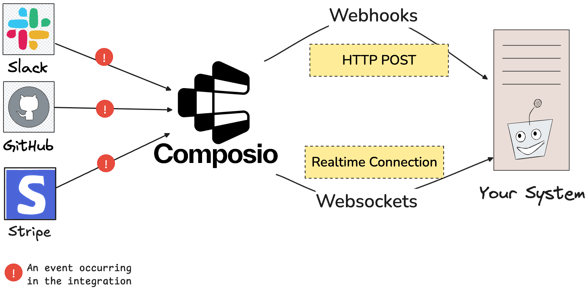

## Overview

Triggers act as a notification system for your AI applications, enabling your agents to respond dynamically to external events occurring within your integrations.

When these events take place, triggers capture relevant information and deliver structured payloads directly to your system, facilitating timely and context-aware responses.

For instance, imagine building a Slack bot designed to generate humorous responses to messages from your co-workers. To achieve this, your application needs to receive notifications whenever someone posts a new message in a specific Slack channel. Triggers fulfill this role by listening for these events and promptly notifying your system, allowing your bot to respond appropriately.

<Frame caption="Triggers through Composio" background="subtle">

</Frame>


Composio supports two primary methods for delivering these payloads:

- **[Webhooks](#specifying-listeners-through-webhooks)**: HTTP POST requests sent to a publicly accessible URL that you configure. Webhooks are ideal for scenarios where your application needs to handle events asynchronously and independently from the event source.

- **[Websockets](#specifying-listeners-through-websockets)**: Persistent, real-time connections that push event data directly to your application. Websockets are suitable for applications requiring immediate, continuous, and low-latency communication.

## Managing triggers
Before proceeding, ensure you've created an integration and established a connection to your external account (e.g., Slack, GitHub).

<Card title="Adding Integrations" href="/auth/introduction" icon="fa-solid fa-plug">
You need to have an integration set up in order to listen on it's triggers. Learn how to set it up here.
</Card>

### Enable the Trigger
Enable the "New Message Received" trigger for your Slack app through the dashboard, CLI, or code.
<Tabs>
<Tab title="Code">
<CodeGroup>
```python Python {9-13}
from composio_openai import ComposioToolSet

toolset = ComposioToolSet()

user_id = "default" # User ID referencing an entity retrieved from application logic
entity = toolset.get_entity(id=user_id)
triggers = toolset.get_trigger("SLACK_RECEIVE_MESSAGE")

res = entity.enable_trigger(
    app=App.SLACK,
    trigger_name="SLACK_RECEIVE_MESSAGE",
    config={}
)

print(res["status"])
```

```TypeScript TypeScript
import { ComposioToolSet } from "composio-core";
const toolset = new ComposioToolSet();

const userId = "default";

const entity = await toolset.getEntity(userId);

const trigger = await toolset.triggers.get({
  triggerId: "SLACK_RECEIVE_MESSAGE",
});

const res = await entity.setupTrigger({
  triggerName: "SLACK_RECEIVE_MESSAGE",
  app: "slack",
  config: {},
});

console.log(res.status);
```
</CodeGroup>

</Tab>
<Tab title="CLI">
In the command-line run:
```bash
composio triggers enable SLACK_RECEIVE_MESSAGE
```
</Tab>
<Tab title="Dashboard">
Head to the [Slack app](https://app.composio.dev/app/slack) in the dashboard and enable the "New Message Recieved" trigger
<video 
    src="../assets/videos/enabling-triggers.mp4"
    width="854"
    height="480"
    autoplay
    loop
    playsinline
    controls
>
</video>
</Tab>


</Tabs>


<Card title="Specifying Trigger Configuration" icon="fa-solid fa-cog">
Some triggers expect certain configuration to set the correct events. You can inspect and add these properties while enabling the triggers.
</Card>
<Steps>
<Step title="Viewing the configuration">
<CodeGroup>
```python
# Using same imports as above
trigger = toolset.get_trigger("GITHUB_STAR_ADDED_EVENT")
print(trigger.config.model_dump_json(indent=4))
```
```typescript TypeScript
// Using same imports as above

const trigger = await toolset.triggers.get({
  triggerId: "GITHUB_STAR_ADDED_EVENT",
});
```
</CodeGroup>
</Step>


```json Expected properties focus {2-15} maxLines=20
{
    "properties": {
        "owner": {
            "description": "Owner of the repository",
            "title": "Owner",
            "default": null,
            "type": "string"
        },
        "repo": {
            "description": "Repository name",
            "title": "Repo",
            "default": null,
            "type": "string"
        }
    },
    "title": "WebhookConfigSchema",
    "type": "object",
    "required": [
        "owner",
        "repo"
    ]
}
```

<Step title="Specifying the configuration">
<CodeGroup>
```python Python
response = entity.enable_trigger(
    app=App.GITHUB,
    trigger_name="GITHUB_PULL_REQUEST_EVENT",
    config={"owner": "composiohq", "repo": "composio"},
)
```
```typescript TypeScript
const res = await entity.setupTrigger({
  triggerName: "GITHUB_PULL_REQUEST_EVENT",
  app: "github",
  config: {
    owner: "composiohq",
    repo: "composio",
  },
});

```
</CodeGroup>
</Step>
</Steps>

## Listeners

Once you have the triggers set up, you can specify listener functions using websockets through the SDK or webhooks.

### Specifying Listeners through Websockets
We create a listener and then define a callback function that executes when a listener recieves a payload.
<CodeGroup>
```python Python
listener = toolset.create_trigger_listener()

@listener.callback(
    filters={
        "trigger_name": "SLACK_RECEIVE_MESSAGE",
    }
)
def handle_slack_message(event):
    print(event)

listener.wait_forever()
```
```typescript TypeScript
const listener = toolset.triggers.subscribe(
    (data) => {
        console.log(data);
    },
    {
        triggerName: "SLACK_RECEIVE_MESSAGE"
    }
)
```
</CodeGroup>

### Specifying Listeners through Webhooks
Assuming you've already set up a trigger as discussed in previous steps, here's how you can use webhooks instead to listen in on new events happening in an app.

<Steps>
<Step title="Configure Webhook URL">
To receive trigger events via webhooks, you need to configure a publicly accessible URL where Composio can send the event payloads. This URL should point to an endpoint in your application that can process incoming webhook requests.


<video 
    src="../assets/videos/configure-webhook-url.mp4"
    width="854"
    height="480"
    autoplay
    loop
    playsinline
    controls
>
</video>

</Step>

<Step title="Listening on the webhooks">
To demonstrate, here's an example of a server to handle incoming webhook requests.
<CodeGroup>
```python Python maxLines=100
from fastapi import FastAPI, Request
from typing import Dict, Any
import uvicorn
import json

app = FastAPI(title="Webhook Demo")

@app.post("/webhook")
async def webhook_handler(request: Request):
    # Get the raw payload
    payload = await request.json()
    
    # Log the received webhook data
    print("Received webhook payload:")
    print(json.dumps(payload, indent=2))
    
    # Return a success response
    return {"status": "success", "message": "Webhook received"}

if __name__ == "__main__":
    uvicorn.run(app, host="0.0.0.0", port=8000)

```
```typescript TypeScript
import express from 'express';
import type { Request, Response } from 'express';
import bodyParser from 'body-parser';

const app = express();
app.use(bodyParser.json());

app.post('/webhook', async (req: Request, res: Response) => {
    const payload = req.body;
    console.log('Received webhook payload:');
    console.log(JSON.stringify(payload, null, 2));
    res.status(200).json({ status: 'success', message: 'Webhook received' });
});

const PORT = process.env.PORT || 8000;

app.listen(PORT, () => {
    console.log(`Server is running on http://0.0.0.0:${PORT}`);
});
```
</CodeGroup>
</Step>

<Tip>To test out webhooks locally, use an SSH tunnel like [ngrok](https://ngrok.com/docs/agent/)</Tip>

</Steps>


## Demo: Roast Slack Messages

Let's build a fun bot that generates snarky greentext responses to Slack messages using `gpt-4.5`.

<Steps>
  <Step title="Set up the FastAPI Server">
    First, let's create a FastAPI server to handle webhook events:

    ```python
    from fastapi import FastAPI, Request
    from openai import OpenAI
    from composio_openai import ComposioToolSet, App, Action
    from dotenv import load_dotenv
    import uvicorn

    load_dotenv()
    app = FastAPI()
    client = OpenAI()
    toolset = ComposioToolSet()
    entity = toolset.get_entity(id="default")
    ```
  </Step>

  <Step title="Track Responded Threads">
    Create a set to avoid duplicate responses:

    ```python
    # Set to keep track of threads we've already responded to
    responded_threads = set()
    ```
  </Step>

  <Step title="Implement Response Generation">
    Create a function to generate snarky responses using `gpt-4.5`. We'll also set up a preprocessor to handle Slack-specific message parameters:

    ```python focus{11-16}
    async def generate_response(payload: Dict[str, Any]):
        ts = payload.get("data", {}).get("ts", "")
        thread_ts = payload.get("data", {}).get("thread_ts", ts)
        channel = payload.get("data", {}).get("channel", "")
        
        # Skip if already responded
        if thread_ts in responded_threads:
            return
        
        responded_threads.add(thread_ts)
        
        # Preprocessor to automatically inject Slack-specific parameters
        def slack_send_message_preprocessor(inputs: Dict[str, Any]) -> Dict[str, Any]:
            inputs["thread_ts"] = ts          # Ensure reply goes to the correct thread
            inputs["channel"] = channel       # Target the specific channel
            inputs["mrkdwn"] = False         # Disable markdown for greentext formatting
            return inputs
    ```
  </Step>

  <Step title="Configure the tools">
    Set up the tools for sending Slack messages. We attach our preprocessor to automatically handle message threading and formatting:

    ```python focus{1-9}
    # Configure tools with the preprocessor to handle Slack-specific parameters
    tools = toolset.get_tools(
        [Action.SLACK_SENDS_A_MESSAGE_TO_A_SLACK_CHANNEL],
        processors={
            "pre": {
                Action.SLACK_SENDS_A_MESSAGE_TO_A_SLACK_CHANNEL: slack_send_message_preprocessor
            }
        }
    )
    
    response = client.chat.completions.create(
        model="gpt-4.5-preview",
        messages=[
            {"role": "system", "content": "Given a slack text. Generate a snarky greentext response mocking the user. Render the response in ``` codeblocks"},
            {"role": "user", "content": payload.get("data", {}).get("text")}
        ],
        tools=tools,
        tool_choice="required"
    )
    toolset.handle_tool_calls(response, entity_id="default")
    ```

    <Note>
    The preprocessor ensures that every message is automatically configured with the correct thread, channel, and formatting settings, reducing the chance of misconfigured responses.
    </Note>
  </Step>

  <Step title="Create Webhook Handler">
    Set up the webhook endpoint to process incoming messages:

    ```python focus{1-10}
    @app.post("/webhook")
    async def webhook_handler(request: Request):
        payload = await request.json()
        if payload.get("type") == "slack_receive_message":
            channel = payload.get("data", {}).get("channel")
            if channel == "YOUR_CHANNEL_ID":  # Replace with your channel ID
                await generate_response(payload)
        return {"status": "success", "message": "Webhook received"}

    uvicorn.run(app, host="0.0.0.0", port=8000)
    ```
  </Step>
</Steps>

<Card title="Testing Locally" icon="terminal">
Run your server locally and use ngrok to expose it:

```bash
# Start your FastAPI server
python webhook.py

# In another terminal, start ngrok
ngrok http 8000
```
</Card>

<Tip>
Remember to update your webhook URL in the Composio dashboard with your ngrok URL.
</Tip>

## Troubleshooting

If you encounter issues with triggers or webhook listeners, you can use the Composio dashboard to inspect detailed trigger logs. The dashboard allows you to review event payloads, identify errors, and manually resend events for testing purposes.

Access the trigger logs [here](https://app.composio.dev/trigger_logs)

<video 
    src="../assets/videos/debugging-triggers.mp4"
    width="854"
    height="480"
    autoplay
    loop
    playsinline
    controls
>
</video>
