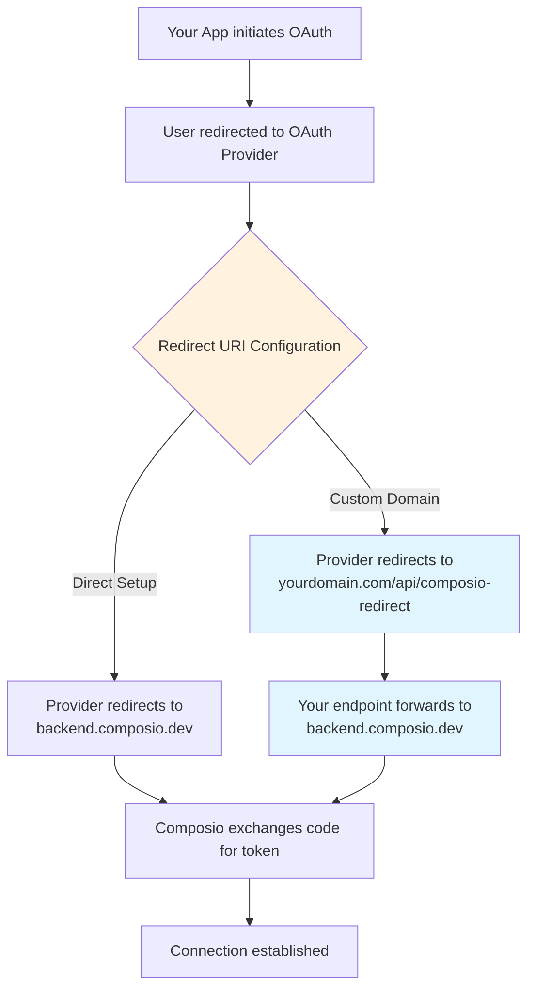

Many toolkits support a level of customization for the auth config, specifically OAuth applications.

This guide will walk you through the process of customizing the auth config for toolkits where you can configure your own developer app.

## Creating a custom auth config

To create a custom auth config, click **Create Auth Config** in your dashboard, then navigate to **Authentication management** → **Manage authentication with custom credentials**.

You'll need to customize the auth config when you want to use different values than the defaults - such as your own subdomain, base URL, client ID, client secret, etc.

<Tabs items={['Example: PostHog', 'Example: Hubspot']}>
  <Tab value="Example: PostHog">
You may change the subdomain for the PostHog toolkit to match your own instance.

<Figure src="/images/custom-auth-posthog.png" alt="PostHog Auth Config Settings" caption="PostHog Auth Config Settings" size="sm" />
  </Tab>
  <Tab value="Example: Hubspot">
For Hubspot you may customize everything here. For each auth scheme there is a different set of fields.

If you choose to use your own developer app for the OAuth2 scheme, you will have to provide the client ID and client secret.

<Figure src="/images/custom-auth-hubspot.png" alt="Hubspot Auth Config Settings" caption="Hubspot Auth Config Settings" size="sm" />
  </Tab>
</Tabs>

Toolkits that support OAuth2 allow using your own developer app. This is the recommended approach for most cases.

<Callout type="info" title="Use your own developer app!">
We recommend using your own developer app for the OAuth2 scheme as it is more suited for production usage with many users and more granular control over scopes.

However, getting OAuth approvals takes time, so Composio provides a default developer app!
</Callout>

## OAuth2 Auth Configs

<Steps>
<Step>
### Generate the OAuth Client ID and Client Secret

To set up a custom OAuth config, you'll need the OAuth Client ID and Client Secret.

You can generate the client ID and client secret from your provider's OAuth configuration page.

Examples for Google and GitHub:

<Tabs items={['Google', 'GitHub']}>
  <Tab value="Google">
<Figure src="/images/google-oauth-config.png" alt="Google OAuth Configuration" caption="Google OAuth Configuration" size="sm" />
  </Tab>
  <Tab value="GitHub">
<Figure src="/images/github-oauth-config.png" alt="GitHub OAuth Configuration" caption="GitHub OAuth Configuration" size="sm" />
  </Tab>
</Tabs>
</Step>

<Step>
### Set the Authorized Redirect URI

When creating your OAuth app, make sure to configure the Authorized Redirect URI to point to the Composio callback URL below:

```
https://backend.composio.dev/api/v3/toolkits/auth/callback
```
</Step>

<Step>
### Create the auth config

Once you have the OAuth credentials, you can add them to the auth config in the dashboard.

1. Select the OAuth2 scheme.
2. Select the scopes to request from users. Default scopes are pre-filled for most apps.
3. Add the OAuth client ID and client secret for your developer app. Keep the redirect URL as is for now!
4. Click Create!

<Figure src="/images/integration-step-3-0.png" alt="Auth Config Settings" caption="Auth Config Settings" size="sm" />
</Step>
</Steps>

This auth config is now ready to be used in your application!

<Tabs groupId="language" items={['Python', 'TypeScript']} persist>
  <Tab value="Python">
```python
# Create a new connected account
connection_request = composio.connected_accounts.initiate(
    user_id="user_id",
    auth_config_id="ac_1234",
)
print(connection_request)

# Wait for the connection to be established
connected_account = connection_request.wait_for_connection()
print(connected_account)
```
  </Tab>
  <Tab value="TypeScript">
```typescript
const connReq = await composio.connectedAccounts.initiate(userId, "ac_1234");

console.log(connReq.redirectUrl);

const connection = await composio.connectedAccounts.waitForConnection(
  connReq.id
);

console.log(connection);
```
  </Tab>
</Tabs>

### White-labeling the OAuth Consent Screen

By default the users will see an OAuth screen like the one below:

<Figure src="/images/oauth-branding.png" alt="Composio's Domain in OAuth Consent Screen" caption="Composio's Domain in OAuth Consent Screen" size="sm" />

The OAuth redirect URL is surfaced in some OAuth providers' consent screens. This may cause confusion for some users as that URL is not of the same domain as the application.

To remediate this:

<Steps>
<Step>
### Set the Authorized Redirect URI

Specify the Authorized Redirect URI to your own domain in the OAuth configuration.
For example:
```
https://yourdomain.com/api/composio-redirect
```
</Step>

<Step>
### Create a redirect logic

Create a redirect logic, either through your DNS or in your application to redirect that endpoint to `https://backend.composio.dev/api/v3/toolkits/auth/callback`

**Example: API Route for OAuth Redirect**

<Tabs groupId="language" items={['Python', 'TypeScript']} persist>
  <Tab value="Python">
```python
from fastapi import FastAPI
from fastapi.responses import RedirectResponse

from composio import Composio

# Create a FastAPI app
app = FastAPI()

# Create a Composio client
composio = Composio()


@app.get("/authorize/{toolkit}")
def authorize_app(toolkit: str):
    # retrieve the user id from your app
    user_id = "<user_id>"

    # retrieve the auth config id from your app
    auth_config_id = "<auth_config_id>"

    # initiate the connection request
    connection_request = composio.connected_accounts.initiate(
        user_id=user_id,
        auth_config_id=auth_config_id,
    )
    return RedirectResponse(url=connection_request.redirect_url)
```
  </Tab>
  <Tab value="TypeScript">
```typescript
import type { NextApiRequest, NextApiResponse } from 'next';

export default function handler(req: NextApiRequest, res: NextApiResponse) {
  // The target Composio endpoint that handles OAuth callbacks
  const composioEndpoint = 'https://backend.composio.dev/api/v3/toolkits/auth/callback';

  // Extract and preserve all query parameters
  const queryParams = new URLSearchParams();
  Object.entries(req.query).forEach(([key, value]) => {
    if (typeof value === 'string') {
      queryParams.append(key, value);
    }
  });

  // Redirect to Composio with all query parameters intact
  const redirectUrl = `${composioEndpoint}?${queryParams.toString()}`;
  res.redirect(302, redirectUrl);
}
```
  </Tab>
</Tabs>
</Step>

<Step>
### Create the auth config

Specify your custom redirect URI in the auth config settings!

<Figure src="/images/custom-redirect-uri.png" alt="Auth Config Settings" caption="Auth Config Settings" size="sm" />
</Step>
</Steps>

With this setup, you can use `https://yourdomain.com/api/composio-redirect` as your OAuth redirect URI, which will create a better user experience by keeping users on your domain during the OAuth flow.

<Accordions>
<Accordion title="How does this work?">

The custom OAuth config allows you to use your own domain in the OAuth consent screen instead of Composio's domain. Here's the core difference:



**Key Benefits:**

- **Custom Domain**: Users see your domain in OAuth consent screens, not Composio's
- **Same Security**: Your domain just forwards the OAuth callback - no token handling
- **Better UX**: Maintains brand consistency throughout the auth flow

The custom redirect endpoint is a simple passthrough that preserves all OAuth parameters while keeping users on your domain.

</Accordion>
</Accordions>
