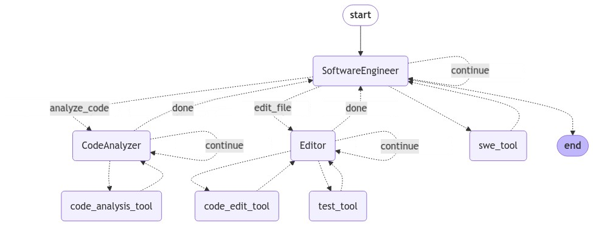

# Composio SWEBench-Agent-v1: SOTA Open-Source Software Engineering Assistant

## Overview

The Composio SWEBench-Agent-v1 is a cutting-edge open-source software engineering assistant that achieves OSS state-of-the-art accuracy on the SWE Bench. This agent is built using [Composio's SWEKit framework](https://docs.composio.dev/swekit/introduction), which allows for the creation of various specialized software engineering agents. SWEKit, integrated with the Langgraph agentic platform, provides a powerful and flexible foundation for developing task-specific software engineering assistants.

## Key Components

Our SWEBench-Agent-v1 utilizes Composio's tools to tackle SWE Bench challenges:

1. **File Editing and Reading Tools**: Enables seamless manipulation and analysis of code files.
2. **Git Tools**: Facilitates version control operations and code management.
3. **Code Indexing Tools**: Allows for semantic code queries, enhancing code understanding and navigation.
4. **LSP Tools**: Provides function and class signatures, improving code comprehension and modification capabilities.

## Agentic Architecture

Our system employs a multi-agent architecture to efficiently handle complex software engineering tasks:

- **SWE ENGINEER**: Acts as the manager agent, orchestrating the overall process.
- **CODE ANALYSIS**: Specialized agent for in-depth code analysis.
- **EDITOR**: Dedicated agent for code modification and execution.



## Getting Started

To get started with the Composio SWEBench-Agent-v1, follow these steps:

1. Install the required packages:
   ```
   pip install -U swekit composio-core
   ```

2. Clone the agent code repository:
   ```
   git clone https://github.com/ComposioHQ/composio.git
   cd composio/python/swe/agent
   ```

3. Run the benchmark with a specific test instance:
   ```
   python benchmark.py --test-instance-ids "django__django-14434"
   ```
   Replace "django__django-14434" with the required instance ID for your test.

For more detailed usage examples and advanced configurations, please refer to our documentation or contact our support team.

## Performance

Our Composio SWEBench-Agent-v1 has demonstrated state-of-the-art OSS performance on the SWE Bench, showcasing its capabilities in handling diverse software engineering tasks.

The agent achieved an impressive 43.4% accuracy on the SWE Bench Verified dataset, successfully solving 217 out of 500 issues. This performance underscores the agent's proficiency in tackling a wide range of software engineering challenges and positions it as a leading solution in the field of automated software engineering assistance.

These results highlight the effectiveness of our multi-agent architecture and the power of Composio's SWEKit toolset in creating highly capable software engineering agents.

> **Note:**
> 1. The agent doesn't have any access to the information about failing and passing test cases from the SWE Bench dataset, that is used to evaluate the agent's performance.
> 2. The agent doesn't have access to the internet. It only has access to the code in the repository and the commit history.

## Other SWEKit Agents

While this README focuses on the SWEBench-Agent-v1, it's important to note that the SWEKit framework enables the creation of various specialized agents. Some potential applications include:

- Refactoring-focused agents
- Language-specific agents (e.g., Golang, Python)
- Frontend development agents
- And more, tailored to specific software engineering needs

## Contributing

We welcome contributions from the community! Please see our [CONTRIBUTING.md](https://github.com/ComposioHQ/composio/blob/master/CONTRIBUTING.md) for guidelines on how to get involved.


## Acknowledgments

- [Composio](https://composio.dev) for providing the [SWEKit framework](https://docs.composio.dev/swekit/introduction) and essential tools.
- [Langgraph](https://github.com/langchain-ai/langgraph) for the agentic platform.
- [SWE Bench](https://github.com/ComposioHQ/swe-bench) for providing the benchmark and dataset.
For more information about SWEKit and our various agents, please contact us at `tech@composio.dev` or visit our [project page](https://github.com/ComposioHQ/swe-agent).
