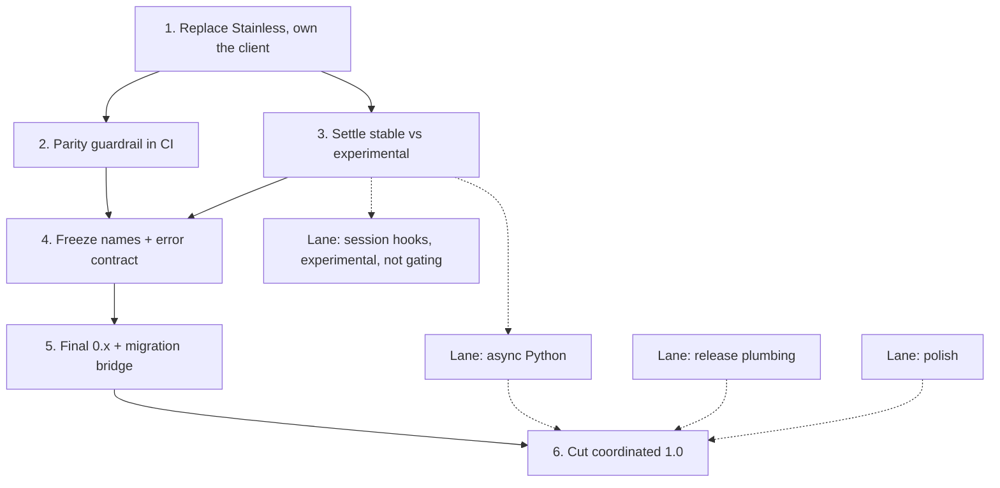

Internal roadmap for promoting the Composio SDK to a coordinated 1.0: `@composio/core` on npm and `composio` on PyPI, plus their provider packages. The reasoning behind each step lives in the SDK 1.0 decision records; this is the ordered execution plan, not the argument.

**Starting point (2026-07-02):** TypeScript `@composio/core` 0.12.0 (providers 0.10.0), Python `composio` 0.16.0 (providers 0.16.0). Both are thin wrappers over a Stainless-generated client (`@composio/client@0.1.0-alpha.74`, `composio-client==1.41.0`).

**What "coordinated 1.0" means:** one product promise across both languages, the same stability guarantees and the same stable/experimental split, announced together. The version integers do not have to match, and the release pipelines stay independent (Changesets on npm, tag-triggered on PyPI). Users want "both SDKs are stable and at declared parity," which is a contract plus a matrix, not a matching string.

# What 1.0 freezes

Every public surface is either stable or experimental, with no third state. Stable surfaces are frozen under semantic versioning for the whole 1.x line: we can add to them, but we cannot remove, rename, or change the meaning of anything on them short of a 2.0. Experimental surfaces can change in any minor release, which is what lets 1.0 ship without freezing the surfaces we are still designing.

| Tier                                    | Surfaces                                                                                                                                                                         |
| --------------------------------------- | -------------------------------------------------------------------------------------------------------------------------------------------------------------------------------- |
| **Stable** (frozen under semver)        | `tools`, `toolkits`, `triggers` (with webhook verification), `auth_configs`, `connected_accounts`, `files`, core construction and config, the provider SPI, the error base types |
| **Experimental** (changes in any minor) | everything under `experimental.*`: custom tools, custom toolkits, the shared-connection ACL                                                                                      |

Two surfaces move on purpose. **Tool Router graduates to stable** before 1.0: it is the flagship feature, and it ships experimental today, which is the wrong label for the thing we most want people to adopt. **MCP stays experimental at 1.0** because it is genuinely in flux, and it graduates in a later 1.x minor once its shape settles. Source: [SDK 1.0 stability contract](https://github.com/ComposioHQ/composio/blob/754efd7507f31612e68774e6bf16628463a8ae39/docs/decisions/sdk-1.0-stability-contract.md#stability-tiers).

# Where the two SDKs stand

TypeScript is the reference implementation; Python tracks it and follows within one minor release. This is the target-state snapshot the parity policy keeps live. The rows marked "stabilizing for 1.0" and "pre-1.0 work" are exactly what the critical path below has to close.

| Capability                      | TypeScript          | Python              | Notes                                      |
| ------------------------------- | ------------------- | ------------------- | ------------------------------------------ |
| tools (get/execute/search/raw)  | stable              | stable              |                                            |
| toolkits                        | stable              | stable              |                                            |
| triggers + webhook verification | stable              | stable              | Pusher realtime both sides                 |
| auth_configs                    | stable              | stable              | Python returns to be tightened from `Dict` |
| connected_accounts              | stable              | stable              | `initiate()` retiring for managed OAuth    |
| files (upload/download)         | stable              | stable              | same safety model both sides               |
| modifiers (schema/before/after) | stable              | stable              | inline objects vs decorators               |
| provider SPI                    | stable              | stable              | frozen for custom-provider authors         |
| Tool Router                     | stabilizing for 1.0 | stabilizing for 1.0 | experimental today                         |
| MCP                             | experimental        | experimental        | graduates in a 1.x minor                   |
| custom tools / toolkits         | experimental        | experimental        | under `experimental.*`                     |
| shared-account ACL              | experimental        | experimental        | under `experimental.*`                     |
| async client                    | n/a (async-native)  | pre-1.0 work        | `AsyncComposio`                            |
| error codes                     | seeds the catalog   | adopts the catalog  | shared `COMPOSIO::` prefix                 |

The same record carries the provider matrix (TypeScript ships 10 adapters, Python 12) and the `@composio/google` to `@composio/gemini` rename. Source: [cross-SDK parity policy](https://github.com/ComposioHQ/composio/blob/754efd7507f31612e68774e6bf16628463a8ae39/docs/decisions/cross-sdk-parity-policy.md#capabilities).

# The critical path

Each step unblocks the next. Three lanes run alongside without blocking the critical path; see "Parallel lanes" at the end.

## Step 1: Replace Stainless to own the generated client

Replace Stainless with a self-hosted [Hey API](https://github.com/hey-api/hey-api) pipeline: declare the backend OpenAPI spec stable, then migrate TypeScript first (with [`@hey-api/openapi-ts`](https://github.com/hey-api/hey-api/tree/main/packages/openapi-ts)) and Python second (with [`@hey-api/openapi-python`](https://github.com/hey-api/hey-api/tree/main/packages/openapi-python)), and cut a stable, semver-managed client (>= 1.0) on both sides, with conformance tests for the `oneOf`/`anyOf` schemas.

- **Depends on:** nothing. This is the foundation.
- **Unblocks:** freezing any public surface. Today the alpha client's types leak straight into the public API through the connected-accounts, tool-router, MCP, and custom-tool types, and a stable contract cannot rest on an alpha, vendor-owned dependency.
- **Done when:** both SDKs pin a >= 1.0 client, the update pipeline opens deterministic PRs from a committed OpenAPI spec, and re-exporting client types is safe.

## Step 2: Erect the parity guardrail

Build a parity check that diffs the two SDKs' namespace and method names (after normalizing camelCase to snake_case), diffs their provider lists against the declared matrix, and confirms the generated-client version pins match. Wire it into both SDKs' CI so it runs on every PR.

- **Depends on:** Step 1 for the client-pin check; the name and provider diffs can start earlier.
- **Unblocks:** every surface change in Steps 3 and 4 and the async lane, which now lands CI-guarded against the target parity matrix, so parity cannot silently drift while things are still moving.
- **Done when:** the check runs in both CI workflows and fails only on undeclared drift.

## Step 3: Settle the stable versus experimental surface

Decide what is stable before freezing it.

- Stabilize Tool Router: remove the experimental tag and lock the `tool_router` session types. It is the flagship feature and ships experimental today, which is the wrong message to send about the thing we most want people to adopt.
- Fix the MCP mislabeling and keep MCP correctly experimental. Both SDKs mount it at a path their own docstrings contradict, and TypeScript references a `wrapMcpServers` hook that does not exist.
- Decide the fate of the TypeScript `@composio/core/generated` subpath. The package publishes this subpath, but what ships is a stub: its `Toolkits` export is a Proxy that throws "run `composio ts generate`" on any access. The real value appears only after a user runs `composio ts generate`, which codegens typed toolkit accessors into their own project and shadows the stub. Because the subpath sits in the published `exports` map, it already counts as public API. Either document it as a supported 1.0 contract and pin the shape `composio ts generate` produces, or unpublish it, so 1.0 does not freeze an opt-in mechanism by accident.
- Finalize the set of deprecated APIs to remove at 1.0, keeping only the ones that mirror live wire payloads.

- **Depends on:** Step 1, for the client-typed surfaces.
- **Unblocks:** the name freeze and the deprecation set. You cannot freeze names on surfaces still in flux.
- **Done when:** every public surface is labeled stable or experimental, with no third state and no contradictions.

## Step 4: Freeze names and the error contract

- Run the 1:1 naming audit and align method names across the two SDKs.
- Execute the `@composio/google` to `@composio/gemini` rename (`gemini` is Google GenAI, `google` is Vertex AI). Usage confirms the scheme: `@composio/google` draws about 5.6k downloads a month, and on PyPI `composio-gemini` (18.7k) outdraws `composio-google` (1.46k) more than ten to one.
- Build the shared `COMPOSIO::` error catalog: TypeScript drops its `TS-SDK::` prefix and seeds the catalog, Python gains codes where it has none and stops collapsing MCP failures into a generic `ValidationError`.

- **Depends on:** Step 3 (settled surfaces), guarded by Step 2.
- **Unblocks:** the deprecations in Step 5 can name their replacements, and the parity check can assert a fixed target instead of a moving one.
- **Done when:** normalized name sets match across the two SDKs and both build against one committed error catalog.

## Step 5: Ship the final 0.x and build the migration bridge

Ship one last 0.x release whose only job is to warn. Mark every API that 1.0 will remove or rename as deprecated, naming the replacement (a TypeScript `@deprecated` annotation, a Python `DeprecationWarning`), and add the new `COMPOSIO::` codes alongside the old ones so handlers can move first. In parallel, build the four things that carry users across: the codemod (jscodeshift for TypeScript, a documented equivalent for Python), a migration agent skill, the consolidated "Upgrading to 1.0" doc page, and the docs version selector.

- **Depends on:** Steps 3 and 4, because the full set of removals, renames, and new codes must be known first.
- **Unblocks:** the 1.0 cut, by giving users editor and runtime warnings before anything breaks.
- **Done when:** a user upgrading through the final 0.x sees, in their own editor and logs, exactly what will change and where to go.

## Step 6: Cut the coordinated 1.0

Remove the deprecated surface from the stable contract. Renamed and moved APIs keep deprecated alias bridges through the whole 1.x line (removed at 2.0); APIs removed with no replacement are deleted now, since they were warned in 0.x. Treat `connected_accounts.initiate()` as a server-driven retirement, not a normal rename: the managed-OAuth endpoint hard-retires 2026-07-03 for all orgs, so point docs and examples at `link()` rather than carry a bridge that would start erroring the moment the backend cuts it off. Tag `@composio/core` 1.0.0 through Changesets and `composio` through its PyPI tag flow.

- **Depends on:** everything above, plus all three lanes green.
- **Done when:** both SDKs are tagged 1.0, Python ships sync and async, the parity check and conformance tests are green, and the migration guide is live.

## Parallel lanes

These run alongside the critical path. The first three must be green before Step 6, the cut; the last is additive and experimental, so it can land in the 1.0 window or a later minor.

### Async Python

Ship `AsyncComposio` alongside the synchronous `Composio`, mirroring the pattern users already know from `openai` and `anthropic`. Adding it is non-breaking, so it does not gate the name freeze or the cut in a semver sense; we pull it into 1.0 because the gap is visible the day someone builds an async server and reaches for our SDK out of habit, and because the parity matrix flags it as the one real capability gap. Best started once the surface is settled (Step 3), so the async variants mirror a stable shape, and it must follow the frozen naming rule (Step 4). Done when Python ships both clients and the parity matrix shows no undeclared gap.

### Release plumbing (low-risk, mechanical)

- **Provider peer ranges:** widen them beyond `>=0.10.0 <1.0.0`, or core 1.0.0 fails the provider peer-dependency check immediately.
- **Python provider pins:** pin providers to `composio>=1.0,<2`; a bare `composio` would let `composio-openai==1.0.0` resolve a future `composio==2.0.0`.
- **Python version drift:** stop `__version__.py` drifting from `pyproject`, so telemetry and the user agent report the right version after the next bump.
- Wire `publint` and `@arethetypeswrong/cli` into the TypeScript release path; they are installed but nothing runs them.

### Polish (should-settle, same release)

- Python: tighten the `t.Dict` returns (auth-config update and delete, MCP get and update) to concrete types, and run the currently skipped custom-provider type-inference test; the custom-provider SPI is the type contract a 1.0 most needs to guarantee and is unverified today.
- TypeScript: stop the barrel `export *` from leaking internal Zod wire schemas; add typecheck scripts and real tests to the nine thin providers; write down the Zod v3/v4 support matrix.
- Cross-cutting: settle one changelog story across the per-package, Python, and product changelogs; validate Python examples in CI the way TypeScript already does; fix the internal release guide, which still says merge to `main`/`master` when the base branch is `next`.

### Session hooks (experimental)

Add a Tool Router session-hooks API to both SDKs, modeled on the Pi provider's existing hooks. Hooks attach client-side `(ctx, next)` middleware to the tools returned by `session.tools(...)`, for policy denial (`ctx.deny(...)`), result replacement, and auth-link routing, and they wrap the existing modifier pipeline rather than replace it. The `session.tools(...)` method stays stable; the `hooks` option and its types are experimental, so this is additive and can land in the 1.0 window or a later minor without a break. It rides on the Tool Router stabilization in Step 3.

# Dependency map

# Decision records

The full reasoning, rejected alternatives, and evidence live in these records, pinned to commit `754efd75`:

- [SDK 1.0 stability contract](https://github.com/ComposioHQ/composio/blob/754efd7507f31612e68774e6bf16628463a8ae39/docs/decisions/sdk-1.0-stability-contract.md): what 1.0 promises, the stable and experimental split, the provider SPI, and the deprecation policy.
- [Cross-SDK parity policy](https://github.com/ComposioHQ/composio/blob/754efd7507f31612e68774e6bf16628463a8ae39/docs/decisions/cross-sdk-parity-policy.md): TypeScript as the reference, the 1:1 naming rule and the gemini rename, the shared error catalog, and the full parity matrix.
- [v0 to v1 migration and deprecation strategy](https://github.com/ComposioHQ/composio/blob/754efd7507f31612e68774e6bf16628463a8ae39/docs/decisions/sdk-v0-to-v1-migration.md): the staged transition, the alias bridges, and the migration tooling.
- [Generated client codegen: Stainless to Hey API](https://github.com/ComposioHQ/composio/blob/754efd7507f31612e68774e6bf16628463a8ae39/docs/decisions/generated-client-codegen.md): the self-hosted generator and the deterministic PR pipeline behind Step 1.
- [SDK parity and 1.0 readiness](https://github.com/ComposioHQ/composio/blob/754efd7507f31612e68774e6bf16628463a8ae39/docs/decisions/sdk-v1-readiness.md): the side-by-side analysis and the engineering backlog behind the plan (analysis, not a decision).
- [Tool Router session hooks](https://github.com/ComposioHQ/composio/blob/754efd7507f31612e68774e6bf16628463a8ae39/docs/decisions/tool-router-session-hooks.md): the experimental `(ctx, next)` middleware layer for `session.tools(...)`, modeled on the Pi provider (experimental and additive, not gating 1.0).
