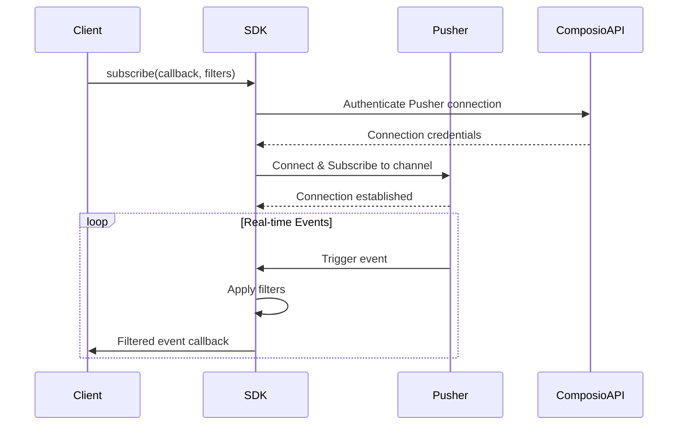

# Trigger System Implementation

This document explains the internal implementation of the trigger system in the Composio SDK.

## Architecture Overview

The trigger system is built on top of Pusher for real-time communication. The implementation consists of two main components:

1. The Triggers class (`packages/core/src/models/Triggers.ts`)
2. The PusherService class (`packages/core/src/services/pusher/Pusher.ts`)

## Real-time Communication

### Pusher Integration

The SDK uses Pusher as the underlying real-time communication infrastructure. When a client subscribes to triggers, the following process occurs:

1. The SDK initializes a PusherService instance
2. The service connects to Pusher using client credentials
3. A channel subscription is established for the client's triggers
4. Incoming messages are processed and filtered based on user-defined criteria

### Message Flow

## API Endpoints

The SDK interacts with the following Composio API endpoints for trigger management:

### Trigger Instance Management

- `GET /api/v3/trigger_instances/active` - List active triggers
- `POST /api/v3/trigger_instances/{slug}` - Create/update trigger instance
  - Includes `toolkit_versions` parameter to specify the toolkit version for the trigger instance (defaults to global configuration)
- `PATCH /api/v3/trigger_instances/manage/{id}` - Update trigger instance
- `DELETE /api/v3/trigger_instances/manage/{id}` - Delete trigger instance

### Trigger Types

- `GET /api/v3/triggers/types` - List trigger types
- `GET /api/v3/triggers/types/{slug}` - Get trigger type details
- `GET /api/v3/triggers/types/enum` - Get trigger type enums

### Pusher Authentication

- `POST /api/v3/internal/sdk/realtime/auth` - Authenticate Pusher connection
- `GET /api/v3/internal/sdk/realtime/credentials` - Necessary credentials to create pusher client

## Data Processing

When a trigger event is received through Pusher, the SDK:

1. Parses the raw event data
2. Validates it against the `IncomingTriggerPayloadSchema`
3. Applies user-defined filters
4. Delivers the processed event to the user's callback

### Filter Processing

The SDK supports filtering triggers based on:

- Toolkit names
- Trigger IDs
- Connected Account IDs
- Trigger slugs
- Trigger data
- User IDs

Filters are applied in a compound manner - all specified filters must match for an event to be delivered.

## Error Handling

The SDK implements robust error handling:

- Schema validation for all incoming and outgoing data
- Connection error recovery
- Callback error isolation (errors in user callbacks don't affect the subscription)
- Automatic reconnection on connection loss

## Security Considerations

- All Pusher communications are authenticated
- API credentials are never exposed to the client
- Each client only receives events they are authorized to see
- Connection credentials are short-lived and rotated regularly
